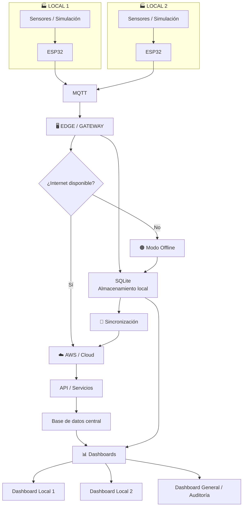

[README.md](https://github.com/user-attachments/files/32879252/README.md)
<div align="center">

# 🏭 Induplac IoT

## Plataforma IoT para el monitoreo energético y operacional

### *Datos que permiten visualizar, comparar y anticipar.*

<br>


</div>

---

## 📋 Información del proyecto

| Información | Detalle |
|---|---|
| **Proyecto** | Induplac IoT |
| **Asignatura** | Problemáticas Globales y Prototipado |
| **Sección** | 002V |
| **Docente** | Marco Antonio Perelli |
| **Institución** | Duoc UC |
| **Fase** | Prototipo / MVP |
| **Contexto** | Empresa real |
| **Datos utilizados** | Ficticios |
| **Arquitectura** | IoT + Edge + Cloud |
| **Conectividad** | Online + Offline |
| **Simulación** | Wokwi *(propuesta)* |

### 👥 Equipo

- Abraham Castro Romero
- Sebastián Fuentes Cortés
- Lisandra González Hernández
- Felipe Murúa Lobos
- Bárbara Saavedra Fernández

---

# 📖 1. Sobre el proyecto

**Induplac IoT** es una propuesta de plataforma para centralizar información energética y operacional de dos locales de una empresa, permitiendo visualizar el estado actual, detectar situaciones anómalas y comparar el comportamiento histórico.

El proyecto utiliza a **Induplac como empresa real de referencia**, pero durante esta etapa se trabajará exclusivamente con **datos ficticios y simulados**.

El objetivo del prototipo es demostrar cómo una arquitectura IoT podría recopilar información desde distintos puntos, procesarla localmente, almacenarla y finalmente visualizarla mediante dashboards.

> ⚠️ Este proyecto no representa datos reales de Induplac ni implica acceso a sus sistemas internos. Los datos utilizados durante el desarrollo y demostración son ficticios.

---

# 🎯 2. Objetivo

Desarrollar un prototipo de plataforma IoT capaz de centralizar información energética y operacional de **dos locales**, permitiendo:

- Monitorear el consumo eléctrico.
- Monitorear el consumo de agua.
- Visualizar producción.
- Visualizar horas sin incidentes (HH).
- Visualizar índice UV.
- Detectar condiciones que requieran atención.
- Comparar períodos históricos.
- Visualizar información de cada local.
- Obtener una visión general mediante un dashboard de auditoría.
- Mantener funcionamiento básico ante una pérdida de conexión a Internet.
- Sincronizar los datos almacenados localmente cuando vuelva la conectividad.

---

# 🌐 3. Problema

La información energética y operacional puede encontrarse distribuida en diferentes fuentes, dificultando obtener una visión rápida del estado de una instalación.

La propuesta busca centralizar estas variables en una plataforma que permita responder preguntas como:

> **¿Cómo está funcionando actualmente cada local?**

> **¿El consumo está aumentando respecto al período anterior?**

> **¿Existe alguna condición que requiera atención?**

> **¿Cómo se está comportando un local respecto a otro?**

> **¿Qué ocurrió durante la última semana o mes?**

---

# 💡 4. Solución propuesta

La solución utiliza una arquitectura híbrida compuesta por:

```text
Sensores / Simulación
        ↓
      ESP32
        ↓
       MQTT
        ↓
   Edge / Gateway
        ↓
      SQLite
        ↓
 ┌──────┴──────┐
 │             │
Internet     Sin Internet
 │             │
 ▼             ▼
AWS           SQLite
 │             │
 └──────┬──────┘
        ↓
   Sincronización
        ↓
    Dashboards
```

La arquitectura está diseñada para que el sistema pueda continuar recopilando información aunque exista una interrupción temporal de Internet.

---

# 🏗️ 5. Arquitectura general



---

# 🔄 6. Flujo de datos

## 🟢 Modo Online

Cuando existe conexión a Internet:

```text
ESP32
  ↓
MQTT
  ↓
Edge
  ↓
SQLite local
  ↓
AWS
  ↓
Base de datos
  ↓
Dashboard
```

El Edge conserva una copia local del dato antes de enviarlo a la nube.

---

## 🟠 Modo Offline

Si se pierde Internet:

```text
ESP32
  ↓
MQTT
  ↓
Edge
  ↓
SQLite
  ↓
Dashboard local
```

Los datos se mantienen localmente hasta que pueda volver a establecerse la conexión.

---

## 🔵 Sincronización

Cuando vuelve Internet:

```text
Internet vuelve
      ↓
Edge detecta conexión
      ↓
SYNCING
      ↓
Obtiene registros pendientes
      ↓
Envía información a AWS
      ↓
AWS confirma recepción
      ↓
Registros marcados como sincronizados
      ↓
ONLINE
```

### Estados del sistema

| Estado | Significado |
|---|---|
| 🟢 **ONLINE** | Sistema conectado y sincronizado |
| 🟠 **OFFLINE** | Sin conexión a Internet |
| 🔵 **SYNCING** | Enviando información pendiente |
| 🔴 **ERROR** | Existe un problema que requiere revisión |

---

# 📊 7. Variables monitoreadas

| Variable | Descripción |
|---|---|
| ⚡ **Electricidad** | Consumo energético |
| 💧 **Agua** | Consumo de agua |
| 🏭 **Producción** | Indicadores de producción |
| 🦺 **HH** | Horas sin incidentes |
| ☀️ **UV** | Índice UV y condición de riesgo |

Los datos de electricidad y agua están planteados con una frecuencia de medición de 15 minutos, mientras que los indicadores operacionales se consideran de actualización diaria.

---

# 🚨 8. Sistema de alertas

## ⚡ Electricidad

Se considera una condición de alerta cuando el consumo horario supera en más de un **20 %** el promedio correspondiente de las cuatro semanas anteriores.

```text
Consumo actual
      ↓
Comparar con histórico
      ↓
¿Supera +20%?
   ↙       ↘
 NO        SÍ
 ↓          ↓
Normal    ⚠ ALERTA
```

## 💧 Agua

Se contempla una alerta cuando el consumo diario supera un umbral establecido.

> El valor definitivo del umbral de agua queda pendiente de definición.

## ☀️ UV

Un índice UV de **8 o superior** se considera una condición de riesgo para personal expuesto al exterior.

---

# 🖥️ 9. Dashboards

La plataforma tendrá **tres dashboards funcionales**:

```text
                    INDUPLAC IoT
                         │
          ┌──────────────┴──────────────┐
          │                             │
      MONITOREO                      AUDITORÍA
          │                             │
    ┌─────┴─────┐                 Dashboard General
    │           │
 Local 1      Local 2
```

---

## 🏭 Dashboard — Local 1

Muestra el estado actual del primer local:

- Electricidad.
- Agua.
- Producción.
- HH.
- UV.
- Alertas.
- Estado de conexión.
- Estado de sensores.
- Última sincronización.
- Registros pendientes.

### Diseño visual base

```text
┌─────────────────────────────────────────────────────────────┐
│ INDUPLAC · LOCAL 1                    🟢 ONLINE              │
├─────────────────────────────────────────────────────────────┤
│                                                             │
│  ⚡ ELECTRICIDAD       💧 AGUA          🏭 PRODUCCIÓN        │
│                                                             │
│      50 kW             1.250 L            132 / 1.240       │
│      ⚠ +25%            ✓ NORMAL            MES / AÑO        │
│                                                             │
├─────────────────────────────────────────────────────────────┤
│                                                             │
│  🦺 HH SIN INCIDENTES                ☀ ÍNDICE UV             │
│                                                             │
│       45.320                           8 ⚠ ALTO              │
│                                                             │
├─────────────────────────────────────────────────────────────┤
│                                                             │
│              ⚡ CONSUMO ELÉCTRICO                           │
│                  [ GRÁFICO ]                               │
│                                                             │
├─────────────────────────────────────────────────────────────┤
│                                                             │
│ ⚠ ALERTAS ACTIVAS                                           │
│                                                             │
├─────────────────────────────────────────────────────────────┤
│ 🟢 SISTEMA   Internet ✓   AWS ✓   ESP32 ✓                  │
│ Última sincronización: 13:58     Pendientes: 0              │
└─────────────────────────────────────────────────────────────┘
```

---

## 🏭 Dashboard — Local 2

Utiliza la misma estructura visual y funcional del Local 1, mostrando exclusivamente la información correspondiente al segundo local.

Esto permite mantener una interfaz consistente entre ambos puntos.

---

# 🏢 10. Dashboard General / Auditoría

El Dashboard General tendrá una función diferente.

No solamente mostrará datos actuales, sino que permitirá obtener una **visión consolidada de ambos locales**.

### Información principal

```text
⚡ Energía total
💧 Agua total
🏭 Producción
🦺 HH
☀️ UV
🚨 Alertas
🟢 Estado de locales
```

También permitirá comparar períodos históricos.

---

# 📅 11. Comparación histórica

La plataforma contará con un selector de período:

```text
┌─────────────────────────────┐
│ PERÍODO                     │
│                             │
│ [ Día ▼ ]                   │
└─────────────────────────────┘
```

Opciones:

- Día.
- Semana.
- Mes.

El período de comparación se adaptará a la selección.

### Ejemplo: Día

```text
Hoy
vs.
Día anterior
```

### Ejemplo: Semana

```text
Esta semana
vs.
Semana anterior
```

### Ejemplo: Mes

```text
Este mes
vs.
Mes anterior
```

También se podrá utilizar un promedio histórico cuando corresponda.

---

# 📈 12. Tabla comparativa

Una de las funciones principales será una tabla que permita analizar ambos locales.

| Local | Período actual | Período anterior | Variación | Estado |
|---|---:|---:|---:|---|
| Local 1 | 50 kW | 42 kW | +19 % | ⚠️ |
| Local 2 | 48 kW | 47 kW | +2 % | 🟢 |

La misma estructura podrá utilizarse para:

- Electricidad.
- Agua.
- Producción.
- HH.
- Otros indicadores disponibles.

El usuario podrá cambiar entre día, semana y mes sin necesitar una pantalla independiente para cada análisis.

---

# 📡 13. Calidad y antigüedad de los datos

El dashboard también indicará qué tan reciente es cada dato.

### Dato actualizado

```text
⚡ 50 kW

🟢 Actualizado
Última lectura: hace 15 segundos
```

### Dato antiguo

```text
⚡ 50 kW

🟠 Último dato conocido
Última lectura: hace 37 minutos
```

### Sin información

```text
⚡ --

🔴 SIN DATOS
Última lectura: hace 3 horas
```

Esto evita interpretar un dato antiguo como si fuera una medición actual.

---

# 🧪 14. Simulación IoT con Wokwi

> **Propuesta en evaluación por el equipo.**

Se contempla utilizar **Wokwi** como entorno de simulación para demostrar el funcionamiento del flujo IoT sin depender inicialmente de hardware físico.

La idea es utilizar ESP32 simulados para generar datos ficticios correspondientes a los dos locales.

```text
┌───────────────────┐
│      WOKWI        │
│                   │
│  ESP32 Local 1    │
│  ESP32 Local 2    │
│                   │
│  ⚡ 💧 ☀️         │
└─────────┬─────────┘
          │
         MQTT
          │
          ▼
        EDGE
          │
          ▼
       AWS/API
          │
          ▼
      DASHBOARD
```

### Escenarios posibles

- 🟢 Funcionamiento normal.
- ⚠️ Consumo eléctrico elevado.
- ⚠️ Índice UV elevado.
- ⚠️ Consumo de agua elevado.
- 🔌 Pérdida de conexión.
- 🔄 Recuperación y sincronización.

La simulación no pretende representar físicamente una instalación industrial real, sino demostrar el comportamiento de la arquitectura propuesta.

---

# 📴 15. Arquitectura híbrida

Una de las características principales del proyecto será su capacidad de funcionar con y sin conexión a Internet.

### Online

```text
ESP32
 ↓
Edge
 ↓
AWS
 ↓
Dashboard
```

### Offline

```text
ESP32
 ↓
Edge
 ↓
SQLite
 ↓
Dashboard local
```

### Recuperación

```text
SQLite
 ↓
Registros pendientes
 ↓
AWS
 ↓
Sincronización
```

---

# 🔐 16. Ciberseguridad

La seguridad será considerada como parte de la arquitectura desde las primeras etapas.

Las principales áreas serán:

- Autenticación.
- Autorización.
- Protección de credenciales.
- Cifrado de comunicaciones.
- Protección de la API.
- Seguridad del dispositivo Edge.
- Seguridad de MQTT.
- Control de acceso a la base de datos.
- Registro de eventos.
- Integridad de datos.
- Copias de seguridad.
- Protección de la sincronización Offline → Online.

La implementación detallada de estas medidas será definida durante las siguientes etapas del proyecto.

---

# 🗂️ 17. Estructura del repositorio

```text
Induplac_IoT/
│
├── README.md
├── CONTRIBUTING.md
├── .gitignore
│
├── docs/
│   ├── arquitectura.md
│   ├── dashboard.md
│   ├── modelo-datos.md
│   ├── modo-offline.md
│   ├── sincronizacion.md
│   ├── ciberseguridad.md
│   ├── stack-tecnologico.md
│   ├── casos-prueba.md
│   ├── decisiones-tecnicas.md
│   └── roadmap.md
│
├── dashboard/
│   ├── src/
│   ├── public/
│   ├── package.json
│   └── README.md
│
├── edge/
│   ├── src/
│   ├── database/
│   └── README.md
│
├── sensors/
│   ├── local-1/
│   ├── local-2/
│   └── README.md
│
├── simulation/
│   ├── local-1/
│   ├── local-2/
│   └── README.md
│
├── backend/
│   ├── api/
│   ├── functions/
│   └── README.md
│
└── infrastructure/
    └── README.md
```

La carpeta `simulation/` podrá utilizarse para Wokwi si el equipo decide incorporarlo.

---

# 🧩 18. Tecnologías

| Área | Tecnología |
|---|---|
| Microcontrolador | ESP32 |
| Comunicación | MQTT |
| Edge | Raspberry Pi / Gateway |
| Base local | SQLite |
| Cloud | AWS |
| Dashboard | React + TypeScript |
| Simulación | Wokwi *(propuesta)* |
| Control de versiones | Git + GitHub |
| Documentación | Markdown + Mermaid |

Las tecnologías pueden cambiar durante la implementación si existe una justificación técnica.

---

# 🏃 19. Plan de desarrollo

## Sprint 1 — Captura de datos

```text
ESP32
 ↓
MQTT
 ↓
Edge
 ↓
Datos ficticios
```

Objetivos:

- Preparar ESP32.
- Definir formato de datos.
- Implementar comunicación.
- Generar datos ficticios.
- Preparar almacenamiento local.

---

## Sprint 2 — Visualización

```text
Datos
 ↓
Backend
 ↓
Dashboard
```

Objetivos:

- Dashboard Local 1.
- Dashboard Local 2.
- Dashboard General.
- Tarjetas de indicadores.
- Alertas.
- Gráficos.
- Comparaciones históricas.

---

## Sprint 3 — Integración híbrida

```text
ONLINE
  ↓
AWS

OFFLINE
  ↓
SQLite

RECUPERACIÓN
  ↓
SYNC
```

Objetivos:

- Implementar modo Offline.
- Implementar sincronización.
- Validar recuperación de conexión.
- Integrar dashboards.
- Ejecutar pruebas.
- Preparar demostración final.

---

# 🧪 20. Pruebas de demostración

### Prueba 1 — Datos normales

```text
ESP32 → Edge → AWS → Dashboard

Resultado esperado:
🟢 Sistema funcionando normalmente
```

### Prueba 2 — Alerta eléctrica

```text
Aumentar consumo
      ↓
Superar umbral
      ↓
⚠ Alerta
```

### Prueba 3 — UV elevado

```text
UV ≥ 8
 ↓
⚠ Riesgo
```

### Prueba 4 — Pérdida de Internet

```text
Internet ❌
 ↓
Edge continúa funcionando
 ↓
SQLite almacena datos
 ↓
Dashboard continúa disponible
```

### Prueba 5 — Recuperación

```text
Internet ✓
 ↓
SYNCING
 ↓
Datos pendientes enviados
 ↓
ONLINE
```

---

# 📌 21. Alcance del MVP

## Incluido

- [x] Dos locales.
- [x] Datos ficticios.
- [x] Electricidad.
- [x] Agua.
- [x] Producción.
- [x] HH.
- [x] UV.
- [x] Diseño de dashboards.
- [x] Alertas.
- [x] Comparaciones históricas.
- [ ] Arquitectura híbrida completa.
- [ ] Almacenamiento local.
- [ ] Sincronización.
- [ ] Ciberseguridad.
- [ ] Simulación Wokwi *(por definir)*.

## Fuera del alcance actual

- Instalación eléctrica real.
- Instalación hidráulica real.
- Acceso a bases de datos reales de Induplac.
- Uso de información personal real.
- Certificación de gestión energética.
- Implementación industrial definitiva.

---

# 🗺️ 22. Roadmap

```text
[✓] Definición del problema
[✓] Propuesta de solución
[✓] Definición de variables
[✓] Arquitectura inicial

[ ] Diseño definitivo de dashboards
[ ] Modelo de datos
[ ] Implementación ESP32
[ ] Comunicación MQTT
[ ] Edge / SQLite
[ ] Dashboard Local 1
[ ] Dashboard Local 2
[ ] Dashboard General
[ ] Comparaciones históricas
[ ] Sistema de alertas
[ ] Modo Offline
[ ] Sincronización
[ ] Ciberseguridad
[ ] Integración Cloud
[ ] Simulación Wokwi
[ ] Pruebas
[ ] Demostración final
```

---

# 🔮 23. Trabajo futuro

Una futura implementación podría incorporar:

- Sensores reales autorizados por la empresa.
- Automatización de indicadores de producción.
- Automatización de HH.
- Alertas mediante correo o mensajería.
- Umbrales configurables.
- Mayor cantidad de locales.
- Integración con sistemas existentes.
- Mejoras de seguridad.
- Analítica avanzada.
- Predicción de consumo.

---

# 🤝 24. Contribución

Para mantener el proyecto ordenado:

1. Crear una rama para cada funcionalidad.
2. Utilizar nombres descriptivos.
3. Realizar commits claros.
4. Documentar cambios importantes.
5. Evitar subir credenciales o claves.
6. Realizar Pull Request antes de integrar cambios importantes.
7. Mantener actualizada la documentación.

Ejemplo:

```text
feature/dashboard-local
feature/mqtt-esp32
feature/offline-mode
feature/aws-integration
feature/cybersecurity
```

---

# ⚠️ 25. Estado actual

> 🚧 **Proyecto en desarrollo**

Actualmente el proyecto se encuentra en etapa de definición y prototipado.

La arquitectura, tecnologías y componentes pueden modificarse durante el desarrollo según las pruebas realizadas y las decisiones del equipo.

Los datos utilizados en esta etapa son ficticios.

---

<div align="center">

## 🏭 Induplac IoT

**Problemáticas Globales y Prototipado · Duoc UC**

*Del dato al análisis. Del análisis a la decisión.*

</div>
