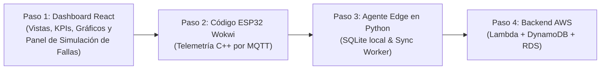

# 🧠 CONTEXTO MAESTRO DEL PROYECTO — Induplac IoT

> **Documento de transferencia de contexto para asistentes y desarrolladores:**  
> Este documento condensa la visión, la filosofía de diseño, los requisitos, las discusiones de ingeniería y el estado del proyecto **Induplac IoT**. Si eres una IA o un desarrollador que retoma este repositorio, este archivo te otorga todo el contexto conversacional previo sin necesidad de acceder al historial de chats.

---

## 1. Visión del Proyecto

### 1.1. ¿Qué es Induplac IoT?
Es una **plataforma IoT industrial de arquitectura híbrida (Edge + Cloud)** concebida para centralizar, monitorear, comparar y anticipar el comportamiento energético y operacional de **dos sedes físicas** de la empresa:
- **Local 1 (Planta / Taller):** Enfocado en maquinaria pesada de fabricación, consumo eléctrico de fuerza, flujo de agua industrial, unidades producidas y radiación solar en zonas de carga.
- **Local 2 (Oficinas / Administración):** Enfocado en consumo eléctrico de climatización e iluminación, agua sanitaria y dotación de personal.

### 1.2. ¿Para quién es?
- **Empresa de Referencia:** **Induplac** (empresa real del sector manufacturero/construcción en Chile).
- **Entorno Académico:** Proyecto desarrollado para **Duoc UC (Sede Plaza Norte)** en la asignatura **SIY6122 — Problemáticas Globales y Prototipado**, Sección 002V.
- **Docente:** **Marco Antonio Perelli**.
- **Equipo de Desarrollo:** Abraham Castro Romero, Sebastián Fuentes Cortés, Lisandra González Hernández, Felipe Murúa Lobos, Bárbara Saavedra Fernández.
- **Proyecto Hermano / Predecesor:** *Project You Shall Not Pass* (repositorio de referencia donde el equipo ya implementó control de acceso con RFID, reconocimiento facial, AWS y Edge). Se mantiene la misma filosofía de documentación, rigor visual (badges Shields.io, Mermaid) y arquitectura de continuidad operacional.

### 1.3. ¿Qué problema resuelve?
En plantas industriales, la información de consumos suele estar dispersa en boletas mensuales o medidores analógicos que nadie revisa a tiempo. Induplac IoT resuelve:
1. **Detección tardía de anomalías:** Identificar en segundos si una máquina quedó encendida fuera de turno o si hay una fuga de agua, en vez de enterarse 30 días después con la factura.
2. **Seguridad ocupacional y ambiental:** Monitoreo del índice de radiación UV en patios exteriores para alertar y proteger a operarios bajo normativa de salud laboral.
3. **Pérdida de visibilidad ante cortes de red:** Si se corta la fibra óptica en la planta, los sistemas 100% cloud quedan inoperativos. Induplac IoT garantiza que el taller siga monitoreando en local sin interrupciones.

---

## 2. Funcionalidades Planeadas

### 2.1. Funcionalidades Implementadas / Especificadas a la Fecha
- [x] **Arquitectura híbrida completa:** Definición del flujo Wokwi (ESP32) ➔ Broker MQTT ➔ Edge Gateway (Raspberry Pi + SQLite) ➔ AWS (DynamoDB + RDS) ➔ Dashboard.
- [x] **Diseño de ciberseguridad en 5 capas (`docs/ciberseguridad.md`):** MQTTS con TLS (8883), validación de límites físicos de telemetría, SQLite local con checksum, tokens idempotentes UUIDv4 anti-replay, matriz RBAC y cumplimiento con la Ley 19.628 de Chile.
- [x] **Infraestructura de red y conectividad segura (`infrastructure/README.md`):** Segmentación con VLANs IoT en locales (`192.168.10.0/24` y `192.168.20.0/24`), reglas de solo salida (*Zero Inbound Ports*), VPN Site-to-Site IPsec IKEv2 AES-256 hacia AWS VPC, y Security Groups referenciados (`SG-Lambda` ➔ `SG-RDS`).
- [x] **Persistencia políglota documentada (`docs/decisiones-tecnicas.md`):** DynamoDB para telemetría cruda continua + RDS PostgreSQL para usuarios/RBAC, catálogo y tablas analíticas agregadas diarias.
- [x] **Especificación matemática del modo offline y retención (`docs/modo-offline.md`):** Cálculo de 34.560 lecturas/día (6,9 MB/día), garantizando > 3 a 8 años de autonomía en una MicroSD de 32 GB.
- [x] **Estructura base del repositorio:** Carpetas iniciales `dashboard/`, `edge/`, `sensors/`, `simulation/`, `backend/`, `docs/`, `.gitignore` y `CONTRIBUTING.md`.

### 2.2. Funcionalidades En Curso / Inmediatas (MVP de Código)
- [ ] **Dashboard Web (React + TypeScript + Tailwind):**
  - Vista individual de Local 1 y Local 2.
  - Vista general / consolidada de auditoría.
  - Indicador tipo semáforo de red (`🟢 ONLINE`, `🔴 OFFLINE`, `🟡 SYNCING`).
  - Selector de períodos de comparación (Día, Semana, Mes).
  - **Panel de Control de Demostración (Simulador de Fallas):** Botón para simular corte de red y botones para inyectar alertas de sobreconsumo o UV alto en vivo frente al docente.
- [ ] **Agente Edge Gateway (Python / Node.js):**
  - Script que escucha el broker MQTT local.
  - Inserción persistente en SQLite con `is_synced = 0`.
  - Hilo de sincronización periódica en lotes (*batch*) hacia AWS.
- [ ] **Simulador ESP32 en Wokwi (C++):**
  - Conexión a red virtual `Wokwi-GUEST`.
  - Publicación periódica de telemetría JSON vía MQTT.

### 2.3. Funcionalidades Futuras (Post-MVP)
- [ ] Despliegue en microcontroladores físicos reales con sensores SCT-013 (corriente) y caudalímetros.
- [ ] Notificaciones externas automáticas a través de WhatsApp / Telegram o Slack mediante webhooks de n8n o Amazon SNS.
- [ ] Analítica predictiva de consumo con modelos sencillos de Machine Learning (detección de patrones de desgaste en maquinaria).

---

## 3. Requisitos y Restricciones del Proyecto

| Requisito / Restricción | Motivo / Contexto | Solución Adoptada |
| :--- | :--- | :--- |
| **AWS Academy Learner Lab** | Presupuesto estricto de **\$100 USD** por alumno; instancias pesadas o NAT Gateways continuos agotan el crédito en días. | Priorizar DynamoDB serverless bajo demanda (costo \$0 para el MVP), usar VPC Endpoints gratuitos y emplear RDS PostgreSQL `db.t3.micro` pausándolo al terminar pruebas. |
| **Empresa Real, Datos Ficticios** | Se utiliza a Induplac como caso de estudio real, pero por ética y confidencialidad no se accede a sus sistemas internos. | Simulación en Wokwi y generadores de datos ficticios pero coherentes con los órdenes de magnitud de la industria. |
| **Resiliencia ante Fallas de Internet** | En faenas industriales los cortes de enlace son frecuentes; la planta no puede parar ni quedarse a ciegas. | Arquitectura híbrida: Edge Gateway retiene todo en SQLite local y el Dashboard puede leer de la Raspberry Pi en red local. |
| **Ley 19.628 de Protección de Datos (Chile)** | El sistema mide Horas Hombre (HH); registrar nombres o RUTs de operarios vulnera la normativa de privacidad laboral. | **Anonimización total:** La métrica de HH solo registra contadores agregados por turno y horas sin accidentes, sin identificación personal. |
| **Cero Puertos Expuestos en Planta** | Abrir puertos hacia la red interna de una fábrica es una vulnerabilidad crítica. | Firewall local con solo tráfico de salida (*Stateful Egress*) y conexión hacia la nube mediante túnel VPN IPsec hacia AWS VPC. |

---

## 4. Decisiones de Arquitectura y Razones de Diseño

### 4.1. Arquitectura Híbrida vs. 100% Cloud Pura
* **Idea descartada:** Enviar datos directamente de los ESP32 a endpoints públicos en la nube de AWS.
* **Por qué se descartó:** Si se corta la conexión a Internet, los sensores no tienen dónde enviar datos, el personal en faena pierde la visualización en tiempo real y se producen pérdidas irrecuperables de métricas.
* **Decisión tomada:** Gateway Edge local (Raspberry Pi) con base de datos SQLite intermedia. El Edge es el buffer de supervivencia y el host local del Dashboard cuando se cae la red.

### 4.2. Persistencia Políglota (DynamoDB + RDS) vs. Un Solo Motor de BD
* **Idea descartada 1:** Usar solo DynamoDB.  
  * *Motivo de descarte:* DynamoDB es excelente para telemetría continua (time-series), pero modelar tablas relacionales de seguridad (usuarios, roles, permisos con JOINs) y consultas analíticas ad-hoc (*"Consumo promedio de esta semana vs. la semana anterior"*) es engorroso y costoso.
* **Idea descartada 2:** Usar solo RDS/Aurora para todo.  
  * *Motivo de descarte:* Escribir mediciones de telemetría cada 5 segundos satura las conexiones de una base relacional pequeña en Learner Lab y encarece el costo innecesariamente.
* **Decisión tomada:** **Persistencia Políglota:**
  - **DynamoDB:** Repositorio NoSQL de telemetría cruda en alta velocidad.
  - **RDS PostgreSQL:** Repositorio relacional para RBAC (usuarios y roles), catálogo de dispositivos y métricas agregadas precalculadas diariamente.

### 4.3. Almacenamiento en Edge vs. Poner MicroSD a cada ESP32
* **Idea descartada:** Eliminar la Raspberry Pi y colocarle un módulo de tarjeta MicroSD a cada ESP32.
* **Por qué se descartó:**
  1. En una fábrica con múltiples tableros y sensores en altura, mantener tarjetas físicas en cada microcontrolador es inviable.
  2. Las tarjetas SD conectadas a microcontroladores sufren alto desgaste (*wear*) y corrupción de datos ante cortes de energía bruscos.
  3. El ESP32 no cuenta con recursos suficientes para levantar túneles VPN IPsec ni servir un dashboard web multiusuario.
* **Decisión tomada:** **Buffer en dos niveles:**
  - **Nivel 1 (ESP32):** Ring Buffer circular en RAM (1.500 muestras $\approx$ 1,5 a 2 horas) para absorber reinicios del Gateway.
  - **Nivel 2 (Raspberry Pi):** Almacenamiento masivo SQLite en disco con capacidad matemática para más de 3 a 8 años de datos offline.

### 4.4. Red y VPN Site-to-Site vs. APIs Públicas
* **Idea descartada:** Enviar la telemetría del Edge hacia AWS a través de endpoints públicos abiertos en Internet.
* **Decisión tomada:** Túnel **VPN Site-to-Site (IPsec IKEv2 con AES-256)** entre el Customer Gateway del Edge y el Virtual Private Gateway de AWS VPC. El tráfico viaja cifrado en Capa 3 y entra directamente a las subredes privadas de la VPC.

---

## 5. Puntos Discutidos Pendientes de Decisión Definitiva

1. **Hardware Físico para la Presentación Final:**
   - Se evaluó si para la entrega final se presentará una maqueta física (ESP32 real sobre protoboard con potenciómetro y LEDs) o si la demostración se realizará 100% sobre Wokwi simulado.
   - *Estado:* Ambos enfoques son técnicamente viables; Wokwi está 100% aprobado como solución oficial de simulación para el prototipo.
2. **Proveedor de Autenticación para el Dashboard MVP:**
   - Se discutió entre usar **Amazon Cognito** real en AWS o implementar un **Mock de Tokens JWT** en el backend para agilizar la entrega sin depender de la configuración de User Pools en Learner Lab.
   - *Estado:* Para la primera iteración del frontend se sugiere Mock JWT con selector de perfiles (Operario / Mantenimiento / Admin) para facilitar la defensa ante el profesor.
3. **Broker MQTT en Desarrollo:**
   - Se debatió entre usar un broker cloud gratuito con TLS (**HiveMQ Cloud**) o levantar un broker local en Docker (**Mosquitto**) en la máquina donde corra el Edge.

---

## 6. Estado Actual vs. Lo que Falta para la Versión 1.0 (MVP)

```text
ESTADO ACTUAL (100% Diseñado y Documentado en 'main'):
├── [OK] Arquitectura Híbrida y Modelo de Estados
├── [OK] Estrategia de Ciberseguridad en 5 Capas (STRIDE + RBAC + Ley 19.628)
├── [OK] Topología de Red (VLANs, VPN Site-to-Site, VPC, Security Groups)
├── [OK] Persistencia Políglota (DynamoDB + RDS PostgreSQL con DDL)
├── [OK] Justificación y Cálculos Matemáticos de Retención Offline
└── [OK] Estructura limpia del repositorio Git con convenciones profesionales

LO QUE FALTA PARA EL MVP EJECUTABLE (En orden):
├── [PENDIENTE] Código del Dashboard en 'dashboard/' (React + Vite + Tailwind)
├── [PENDIENTE] Código del Agente Edge en 'edge/' (Python: MQTT -> SQLite -> Sync)
├── [PENDIENTE] Código C++ para ESP32 en 'simulation/' (Wokwi C++ sketch)
└── [PENDIENTE] Funciones Lambda y API Gateway en 'backend/'
```

---

## 7. Roadmap y Próximos Pasos Priorizados



1. **Paso 1 (Prioridad Máxima) — Construir el Dashboard Web (React):**
   - Levantar la aplicación en `dashboard/` con Vite y Tailwind CSS.
   - Implementar las tarjetas de métricas (Energía, Agua, UV, HH, Producción) para Local 1, Local 2 y Consolidado.
   - Implementar el selector de períodos (Día, Semana, Mes).
   - **Vital para la evaluación:** Agregar el componente interactivo de control de pruebas:
     - Interruptor `Simular Corte de Red` (conmuta la UI entre `🟢 ONLINE` y `🔴 OFFLINE`).
     - Botón `Inyectar Alerta de Sobreconsumo` para ver la alerta visual en tiempo real.
2. **Paso 2 — Código del ESP32 en Wokwi:**
   - Crear el sketch de Arduino/C++ con lectura de sensores virtuales y publicación periódica en formato JSON hacia el broker MQTT.
3. **Paso 3 — Agente Edge Gateway:**
   - Script en Python (`edge_gateway.py`) que consuma de MQTT, escriba en SQLite con `is_synced = 0` y simule la sincronización en lotes.
4. **Paso 4 — Infraestructura Cloud en AWS:**
   - Despliegue de Lambda de ingesta, tabla DynamoDB y tabla relacional RDS en el Learner Lab.

---

## 8. Detalles y Casos de Uso Clave Mencionados

### 8.1. El Caso de Demostración para el Profesor Marco Antonio Perelli
Durante la conversación se enfatizó que la evaluación docente no se gana únicamente mostrando gráficos estáticos, sino demostrando la **resiliencia híbrida en vivo**:
> **El "Showcase" de la presentación:**
> 1. El sistema opera normalmente en `🟢 ONLINE`.
> 2. Se presiona el botón de desconexión: el Dashboard pasa a `🔴 OFFLINE` indicando que consume datos de la Raspberry Pi local.
> 3. El ESP32 sigue generando lecturas; la Raspberry Pi las guarda en SQLite (`is_synced = 0`).
> 4. Se reconecta la red: la interfaz muestra `🟡 SINCRONIZANDO (XX datos pendientes)`.
> 5. Los datos suben a AWS, se valida la deduplicación idempotente y la interfaz vuelve a `🟢 ONLINE` **sin haber perdido ni un solo dato**.

### 8.2. Mapeo de Variables y Colores Semafóricos
- **Energía Eléctrica (kW):** Umbral normal $< 45\text{ kW}$ (`Verde`), advertencia $45 - 55\text{ kW}$ (`Amarillo`), crítico $> 55\text{ kW}$ (`Rojo`).
- **Consumo de Agua (m³):** Indicador continuo acumulativo con detección de fugas nocturnas.
- **Radiación Solar (Índice UV):** Escala 1 a 12. Al superar $6\text{ UVI}$, la plataforma genera advertencia para uso obligatorio de protector y descanso bajo sombra para operarios en patio.
- **Horas Hombre (HH):** Contador de días/horas sin accidentes con tiempo perdido.
- **Producción:** Contador de placas y molduras fabricadas contra la meta del turno.
