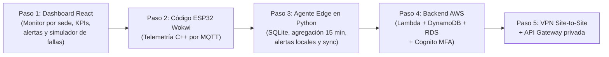

# 🧠 CONTEXTO MAESTRO DEL PROYECTO — Induplac IoT

> **Documento de transferencia de contexto para asistentes y desarrolladores:**  
> Este documento condensa la visión, la filosofía de diseño, los requisitos, las discusiones de ingeniería y el estado del proyecto **Induplac IoT**. Si eres una IA o un desarrollador que retoma este repositorio, este archivo te otorga todo el contexto conversacional previo sin necesidad de acceder al historial de chats.
>
> **Última actualización:** 2026-10-08 — incorpora el documento del equipo *"Decisiones Cloud aplicadas al proyecto Induplac"* y las decisiones tomadas a partir de él. El detalle de la discusión está en `docs/notas-de-avance.md`.

---

## 1. Visión del Proyecto

### 1.1. ¿Qué es Induplac IoT?
Es una **plataforma IoT industrial de arquitectura híbrida (Edge + Cloud)** concebida para centralizar, monitorear, comparar y anticipar el comportamiento energético y operacional de **dos sedes físicas** de la empresa:
- **Local 1 (Planta / Taller):** Enfocado en maquinaria pesada de fabricación, consumo eléctrico de fuerza, flujo de agua industrial, tableros producidos y radiación solar en zonas de carga.
- **Local 2 (Oficinas / Administración):** Enfocado en consumo eléctrico de climatización e iluminación, agua sanitaria y dotación de personal.

### 1.2. ¿Para quién es?
- **Empresa de Referencia:** **Induplac** (empresa real del sector manufacturero/construcción en Chile).
- **Entorno Académico:** Proyecto desarrollado para **Duoc UC (Sede Plaza Norte)** en la asignatura **SIY6122 — Problemáticas Globales y Prototipado**, Sección 002V.
- **Docente:** **Marco Antonio Perelli**.
- **Equipo de Desarrollo:** Abraham Castro Romero, Sebastián Fuentes Cortés, Lisandra González Hernández, Felipe Murúa Lobos, Bárbara Saavedra Fernández.
- **Proyecto Hermano / Predecesor:** *Project You Shall Not Pass* (repositorio de referencia donde el equipo ya implementó control de acceso con RFID, reconocimiento facial, AWS y Edge). Se mantiene la misma filosofía de documentación, rigor visual (badges Shields.io, Mermaid) y arquitectura de continuidad operacional.

### 1.3. ¿Qué problema resuelve?
En plantas industriales, la información de consumos suele estar dispersa en boletas mensuales o medidores analógicos que nadie revisa a tiempo. Induplac IoT resuelve:
1. **Detección tardía de anomalías:** Identificar si una máquina quedó encendida fuera de turno o si hay una fuga de agua, en vez de enterarse 30 días después con la factura.
2. **Seguridad ocupacional y ambiental:** Monitoreo del índice de radiación UV en patios exteriores para alertar y proteger a operarios bajo normativa de salud laboral.
3. **Pérdida de visibilidad ante cortes de red:** Si se corta la fibra óptica en la planta, los sistemas 100% cloud quedan inoperativos. Induplac IoT garantiza que el taller siga monitoreando y recibiendo alertas en local, **exactamente igual que con conexión**.

---

## 2. Funcionalidades Planeadas

### 2.1. Funcionalidades Implementadas / Especificadas a la Fecha
- [x] **Arquitectura híbrida completa:** Wokwi (ESP32) ➔ Broker MQTT ➔ Edge Gateway (Raspberry Pi + SQLite, agregación de 15 min, alertas locales, dashboard de planta) ➔ VPN IPsec ➔ AWS (API Gateway privada + Lambda + DynamoDB + RDS) ➔ Dashboard de gerencia.
- [x] **Diseño de ciberseguridad en 5 capas (`docs/ciberseguridad.md`):** MQTTS con TLS (8883), validación de límites físicos, SQLite con checksum, idempotencia por intervalo, VPN IPsec, RBAC con MFA para roles con permisos de escritura y cumplimiento con la Ley 19.628 de Chile.
- [x] **Infraestructura de red y conectividad segura (`infrastructure/README.md`):** VLANs IoT (`192.168.10.0/24` y `192.168.20.0/24`), VLAN de operarios con acceso solo HTTPS al Edge, *Zero Inbound Ports*, VPN Site-to-Site IPsec IKEv2 AES-256 hacia AWS VPC, API Gateway privada para ingesta y Security Groups referenciados (`SG-Lambda` ➔ `SG-RDS`).
- [x] **Persistencia políglota documentada (`docs/decisiones-tecnicas.md`):** DynamoDB para la serie de tiempo de intervalos de 15 min + RDS PostgreSQL para usuarios/RBAC, catálogo, umbrales, alertas e históricos agregados.
- [x] **Especificación del modo offline y retención (`docs/modo-offline.md`).**
- [x] **Decisiones Cloud del equipo** (documento entregado 2026-10-07), integradas en este archivo.
- [x] **Estructura base del repositorio:** Carpetas `dashboard/`, `edge/`, `sensors/`, `simulation/`, `backend/`, `docs/`, `infrastructure/`, `.gitignore` y `CONTRIBUTING.md`.

### 2.2. Funcionalidades En Curso / Inmediatas (MVP de Código)
- [ ] **Dashboard Web (React + TypeScript + Tailwind):**
  - Monitor por sede (Local 1, Local 2) y vista consolidada para gerencia.
  - Consumo actual de electricidad y agua comparado contra el promedio histórico.
  - Producción (tableros del mes y acumulado anual), HH sin incidentes e índice UV del día.
  - Alertas activas destacadas en rojo.
  - Histórico: comparación entre sedes y entre períodos.
  - Indicador de estado de enlace (`🟢 ONLINE`, `🔴 OFFLINE`, `🟡 SINCRONIZANDO`).
  - **Mismo build en dos lugares:** servido por la Raspberry Pi en planta (lee la API local) y en la nube para gerencia (lee la API pública con Cognito).
  - **Panel de Control de Demostración (Simulador de Fallas):** Botón para simular corte de red y botones para inyectar alertas de sobreconsumo o UV alto en vivo frente al docente.
- [ ] **Agente Edge Gateway (Python):**
  - Escucha el broker MQTT local, valida rangos y guarda las lecturas crudas en SQLite.
  - Calcula **promedios cada 15 minutos** y los encola con `is_synced = 0`.
  - **Motor de alertas local** con las mismas reglas que la Lambda.
  - API local + servidor del dashboard de planta.
  - Hilo de sincronización en lotes hacia AWS por la VPN.
- [ ] **Simulador ESP32 en Wokwi (C++):**
  - Conexión a red virtual `Wokwi-GUEST`, hora por NTP.
  - Publicación periódica de telemetría JSON vía MQTT.
- [ ] **Backend AWS:** Lambda de ingesta y alertas, API de consulta para el dashboard, Cognito con MFA.

### 2.3. Funcionalidades Futuras (Post-MVP)
- [ ] Despliegue en microcontroladores físicos reales con sensores SCT-013 (corriente) y caudalímetros.
- [ ] Notificaciones externas automáticas (correo, Telegram, Slack) mediante Amazon SNS o webhooks de n8n.
- [ ] Analítica predictiva de consumo con modelos sencillos de Machine Learning.
- [ ] Ideas de históricos en evaluación (comparación por estaciones, análisis por hora/dispositivo): ver `docs/notas-de-avance.md`.

---

## 3. Requisitos y Restricciones del Proyecto

| Requisito / Restricción | Motivo / Contexto | Solución Adoptada |
| :--- | :--- | :--- |
| **AWS Academy Learner Lab** | Presupuesto estricto de **\$100 USD** por alumno; servicios con costo por hora agotan el crédito. | DynamoDB on-demand (costo ~\$0), RDS `db.t3.micro` Single-AZ apagado fuera de pruebas, sin NAT Gateway. La VPN y el endpoint de API privada tienen costo por hora: se levantan para pruebas y demo (ver `infrastructure/README.md`). |
| **Empresa Real, Datos Ficticios** | Se utiliza a Induplac como caso de estudio real, pero por ética y confidencialidad no se accede a sus sistemas internos. | Simulación en Wokwi y generadores de datos ficticios coherentes con los órdenes de magnitud de la industria. A la nube no sube ningún dato que identifique a la organización real o a personas. |
| **Resiliencia ante Fallas de Internet** | En faenas industriales los cortes de enlace son frecuentes; la planta no puede parar ni quedarse a ciegas. | El Edge guarda, agrega, alerta y sirve el dashboard de planta. Sin internet la planta funciona **igual que online**. |
| **Ley 19.628 de Protección de Datos (Chile)** | El sistema mide Horas Hombre (HH); registrar nombres o RUTs de operarios vulnera la normativa de privacidad laboral. | **Anonimización total:** HH solo como contadores agregados por turno y horas sin incidentes. |
| **Cero Puertos Expuestos en Planta** | Abrir puertos hacia la red interna de una fábrica es una vulnerabilidad crítica. | Firewall con solo tráfico de salida (*Stateful Egress*) y conexión hacia AWS por túnel VPN IPsec iniciado desde la planta. |
| **Cambios solo por personal autorizado** | Modificar umbrales, usuarios o configuración tiene impacto operacional. | Autenticación con **MFA (TOTP, Microsoft Authenticator)** obligatoria para los roles con permisos de escritura. |

---

## 4. Decisiones de Arquitectura y Razones de Diseño

> Registro formal en `docs/decisiones-tecnicas.md` (ADR-01 a ADR-08).

### 4.1. Arquitectura Híbrida vs. 100% Cloud Pura
* **Idea descartada:** Enviar datos directamente de los ESP32 a endpoints públicos en la nube de AWS.
* **Por qué se descartó:** Si se corta la conexión a Internet, los sensores no tienen dónde enviar datos, el personal en faena pierde la visualización y se pierden métricas.
* **Decisión tomada:** Gateway Edge local (Raspberry Pi) con SQLite. El Edge es el buffer de supervivencia, el agregador, el motor de alertas local y el servidor del dashboard de planta.

### 4.2. Regla General: el Edge filtra, guarda y agrega; AWS consolida, compara y decide
* **Local (Edge Gateway + SQLite):** lecturas crudas recientes (cada 5 s), validación, cálculo de intervalos de 15 min, buffer offline, alertas locales y dashboard de planta.
* **Backend (AWS):** histórico de intervalos, cálculo de alertas, inventario de dispositivos, usuarios y roles, vista consolidada de ambas sedes.
* **Qué sube a AWS:** solo datos **agregados y validados**, nunca la lectura cruda:
  - Consumo: promedios de electricidad y agua **cada 15 minutos**.
  - Producción: tableros fabricados en el mes y acumulado anual.
  - Seguridad: horas-hombre sin incidentes.
  - Ambiental: índice UV (máximo del intervalo y del día).

### 4.3. Protocolo por Tramo
| Tramo | Protocolo | Motivo |
| :--- | :--- | :--- |
| ESP32 → Edge Gateway | MQTT sobre TLS (MQTTS, 8883) | Liviano, pensado para dispositivos con pocos recursos. |
| Edge Gateway → AWS | HTTPS/REST contra **API Gateway privada**, dentro del túnel VPN IPsec | Cifrado en Capa 3 + Capa 7; la ingesta no se expone a Internet. |
| Dashboard → Backend | HTTPS/REST | Planta: API local del Edge. Gerencia: API pública de consulta con autenticación Cognito. |

### 4.4. Persistencia Políglota (SQLite + DynamoDB + RDS)
* **SQLite (Edge):** crudo reciente, intervalos pendientes de sincronizar, alertas locales y réplica de intervalos para el dashboard offline.
* **DynamoDB:** serie de tiempo de intervalos de 15 min por local y variable.
* **RDS PostgreSQL:** usuarios, roles, catálogo de locales/dispositivos, umbrales, **alertas** e históricos agregados para reportes.
* **Por qué dos bases en la nube (no por volumen):** DynamoDB on-demand cuesta ~\$0 y está siempre disponible, por lo que se puede **apagar RDS sin cortar la ingesta**; además, Lambda escribe en DynamoDB por API HTTP sin agotar conexiones, mientras que RDS necesita JOINs e integridad para RBAC y reportes. Alternativa evaluada: solo PostgreSQL (+ TimescaleDB), más simple pero pierde esas dos ventajas.

### 4.5. Alertas en Dos Niveles
* **Lambda (AWS):** evalúa cada intervalo nuevo, registra la alerta en RDS y el dashboard la destaca en rojo.
* **Edge (local):** evalúa las mismas reglas sobre los mismos intervalos para que la planta tenga alertas **también sin internet**.
* **Sin duplicados:** cada alerta se identifica por `local + variable + inicio_intervalo`; si el Edge la generó offline y luego Lambda evalúa el mismo intervalo, se actualiza la misma alerta en vez de crear otra.

### 4.6. Almacenamiento en Edge vs. MicroSD en cada ESP32
* **Idea descartada:** Eliminar la Raspberry Pi y colocarle un módulo MicroSD a cada ESP32 (mantención inviable, desgaste y corrupción de tarjetas, el ESP32 no puede levantar VPN ni servir el dashboard).
* **Decisión tomada:** **Buffer en dos niveles:** Ring Buffer en RAM del ESP32 (~1.500 muestras ≈ 2 horas) + SQLite en la Raspberry Pi.

### 4.7. VPN Site-to-Site Real
* **Decisión:** Túnel **VPN Site-to-Site (IPsec IKEv2, AES-256)** real entre cada Edge (strongSwan como Customer Gateway) y el Virtual Private Gateway de la VPC. La ingesta usa una **API Gateway privada** alcanzable solo desde la VPC mediante un **VPC Interface Endpoint (execute-api)**, de modo que el tráfico del Edge nunca sale por Internet público.
* **Costo:** la conexión VPN y el endpoint de interfaz se cobran por hora; se levantan para pruebas y para la demo (detalle en `infrastructure/README.md`).

### 4.8. Autenticación con MFA
* **Decisión:** Amazon Cognito con **MFA TOTP** (compatible con Microsoft Authenticator), **obligatorio para los roles que pueden cambiar cosas** (Administrador y Jefe de Mantenimiento/Operaciones). El Operario, que solo consulta, inicia sesión sin MFA.
* **Sin internet:** la planta sigue viendo el dashboard con un login local en el Edge; los cambios de configuración (umbrales, usuarios) requieren conexión y MFA. Ver `docs/ciberseguridad.md`.

---

## 5. Puntos Discutidos Pendientes de Decisión Definitiva

1. **Hardware Físico para la Presentación Final:** maqueta física (ESP32 real) o demostración 100% en Wokwi. *Estado:* ambos viables; Wokwi aprobado como simulación oficial.
2. **Broker MQTT en Desarrollo:** **HiveMQ Cloud** (TLS gratis) o **Mosquitto** en Docker en el Edge. *Ojo:* el ESP32 en Wokwi web sale por `Wokwi-GUEST` y no alcanza un broker en la LAN sin el gateway privado de Wokwi.
3. **Acciones permitidas offline:** propuesta en `docs/ciberseguridad.md` (reconocer alertas con login local; umbrales y usuarios solo online). Validar con el equipo.
4. **Disponibilidad en Learner Lab:** verificar que el Learner Lab permita crear VPN Site-to-Site, VPC Interface Endpoints y Cognito con MFA. Plan B para la VPN: instancia EC2 con strongSwan como extremo del túnel en la VPC.

> Resueltos el 2026-10-08: proveedor de autenticación (Cognito + MFA para roles con escritura), comportamiento offline del dashboard (igual que online), alertas offline (Edge + Lambda) y VPN (real).

---

## 6. Estado Actual vs. Lo que Falta para la Versión 1.0 (MVP)

```text
ESTADO ACTUAL (Diseñado y Documentado):
├── [OK] Arquitectura Híbrida y Modelo de Estados
├── [OK] Decisiones Cloud del equipo (agregación 15 min, alertas, RBAC + MFA)
├── [OK] Estrategia de Ciberseguridad en 5 Capas (STRIDE + RBAC + MFA + Ley 19.628)
├── [OK] Topología de Red (VLANs IoT y de operarios, VPN Site-to-Site, VPC, API privada, Security Groups)
├── [OK] Persistencia Políglota (SQLite + DynamoDB + RDS PostgreSQL)
├── [OK] Especificación del Modo Offline y Retención
└── [OK] Estructura limpia del repositorio Git con convenciones profesionales

LO QUE FALTA PARA EL MVP EJECUTABLE (En orden):
├── [PENDIENTE] Código del Dashboard en 'dashboard/' (React + Vite + Tailwind)
├── [PENDIENTE] Código C++ para ESP32 en 'simulation/' (Wokwi)
├── [PENDIENTE] Agente Edge en 'edge/' (Python: MQTT -> SQLite -> Agregación 15 min -> Alertas -> Sync)
├── [PENDIENTE] Backend AWS en 'backend/' (Lambda ingesta/alertas, API consulta, Cognito MFA)
└── [PENDIENTE] VPN Site-to-Site + API Gateway privada (verificar Learner Lab)
```

---

## 7. Roadmap y Próximos Pasos Priorizados



1. **Paso 1 (Prioridad Máxima) — Dashboard Web (React):** monitor por sede, tarjetas (Energía, Agua, UV, HH, Producción), comparación contra promedio histórico, alertas en rojo, selector de períodos y el panel de simulación (`Simular Corte de Red`, `Inyectar Alerta`).
2. **Paso 2 — ESP32 en Wokwi:** sketch C++ con lectura de sensores virtuales, NTP y publicación JSON por MQTT.
3. **Paso 3 — Agente Edge Gateway:** `edge_gateway.py` que consume MQTT, guarda crudo, calcula intervalos de 15 min, evalúa alertas, sirve el dashboard y sincroniza.
4. **Paso 4 — Backend AWS:** Lambda de ingesta y alertas, DynamoDB, RDS, API de consulta y Cognito con MFA.
5. **Paso 5 — Conectividad:** VPN Site-to-Site y API Gateway privada con VPC Endpoint.

---

## 8. Detalles y Casos de Uso Clave

### 8.1. El Caso de Demostración para el Profesor Marco Antonio Perelli
La evaluación se gana demostrando la **resiliencia híbrida en vivo**:
> **El "Showcase" de la presentación:**
> 1. El sistema opera normalmente en `🟢 ONLINE`.
> 2. Se corta la red: el dashboard de planta sigue mostrando datos **en tiempo real** desde la Raspberry Pi y solo cambia el indicador a `🔴 OFFLINE`.
> 3. Se inyecta un UV alto: **la alerta aparece igual**, generada por el Edge.
> 4. Los intervalos de 15 min y las alertas se acumulan en SQLite (`is_synced = 0`).
> 5. Se reconecta la red: la interfaz muestra `🟡 SINCRONIZANDO (XX pendientes)`.
> 6. Los intervalos suben a AWS por la VPN, la alerta generada offline aparece en el dashboard de gerencia **sin duplicarse** y la interfaz vuelve a `🟢 ONLINE` **sin haber perdido ni un solo dato**.

### 8.2. Variables, Reglas de Alerta y Colores
- **Energía Eléctrica (kW / kWh):**
  - Alerta 🔴 si el consumo horario supera en **20 % el promedio de las últimas 4 semanas en ese mismo horario**.
  - Mientras no existan 4 semanas de historia se usa el umbral fijo de respaldo: normal < 45 kW (`Verde`), advertencia 45–55 kW (`Amarillo`), crítico > 55 kW (`Rojo`).
- **Consumo de Agua (m³):** alerta 🔴 cuando el consumo diario supera el umbral definido por local (tabla `umbrales_alerta`). Se mantiene la detección de consumo nocturno como indicio de fuga.
- **Radiación Solar (Índice UV, escala 1 a 12):** alerta 🔴 con **valor 8 o superior** (riesgo para personal en exteriores). Entre 6 y 7,9 se muestra en amarillo como recomendación de protector y sombra.
- **Horas Hombre (HH):** contador de horas sin incidentes con tiempo perdido.
- **Producción:** tableros fabricados en el mes y acumulado anual.
- Correo/Telegram para alertas: mejora futura, fuera del MVP.

### 8.3. Roles
| Rol | Acceso | MFA |
| :--- | :--- | :---: |
| **Operario** | Indicadores de su propia sede (solo lectura) | No |
| **Jefe de Mantenimiento/Operaciones** | Ambas sedes y gestión de alertas | Sí |
| **Administrador** | Acceso total: usuarios, configuración y umbrales | Sí |
