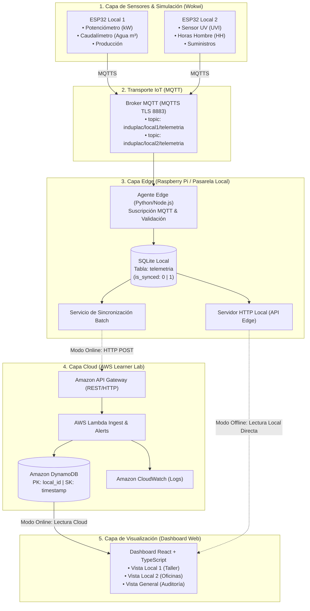
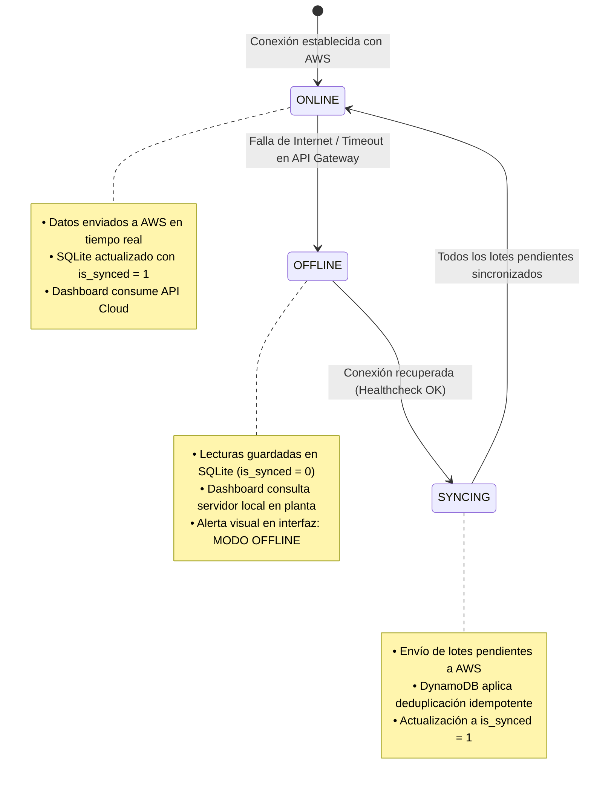

# 🏗️ Arquitectura Híbrida y Modelo de Integración — Induplac IoT

## 1. Propósito y Enfoque

La plataforma **Induplac IoT** está diseñada bajo un paradigma **híbrido (Edge + Cloud)** que garantiza continuidad operacional ininterrumpida ante caídas del suministro de Internet o contingencias en la nube, replicando el estándar de resiliencia desarrollado en *Project You Shall Not Pass*.

El sistema desacopla la captura y almacenamiento en planta de la consolidación analítica en la nube, permitiendo que la toma de decisiones locales continúe operando en todo momento.

---

## 2. Diagrama de Arquitectura Global



---

## 3. Detalle de Capas Técnicas

### 3.1. Capa 1: Captura y Microcontroladores (Wokwi / ESP32)
- **Entorno de Simulación:** Wokwi con emulación del microcontrolador ESP32-WROOM-32.
- **Conectividad:** Pila de red Wi-Fi virtual (`Wokwi-GUEST`) con soporte DHCP y DNS.
- **Comportamiento:** Cada 5 segundos realiza lectura analógica/digital, construye un payload JSON y lo publica hacia el broker MQTT.

### 3.2. Capa 2: Broker MQTT
- **Protocolo:** MQTT 3.1.1 / 5.0 sobre TLS (puerto 8883).
- **Segmentación por Tópicos:**
  - `induplac/local1/telemetria`
  - `induplac/local2/telemetria`
  - `induplac/alertas`

### 3.3. Capa 3: Pasarela Edge y Base de Datos Local (SQLite)
La pasarela local (Raspberry Pi o máquina anfitriona) actúa como buffer de continuidad.
Esquema de la tabla local en SQLite:

```sql
CREATE TABLE IF NOT EXISTS telemetria_local (
    record_id TEXT PRIMARY KEY,       -- UUIDv4 generado en Edge
    device_id TEXT NOT NULL,          -- Identificador de microcontrolador
    local_id TEXT NOT NULL,           -- local-1 | local-2
    timestamp INTEGER NOT NULL,       -- Unix timestamp en segundos UTC
    potencia_kw REAL NOT NULL,        -- Consumo eléctrico instantáneo
    agua_m3 REAL NOT NULL,            -- Consumo acumulado de agua
    indice_uv REAL NOT NULL,          -- Radiación UV
    unidades_prod INTEGER NOT NULL,   -- Unidades fabricadas
    hh_activas INTEGER NOT NULL,      -- Horas hombre activas
    is_synced INTEGER DEFAULT 0,      -- 0: Pendiente de sync | 1: Sincronizado en AWS
    created_at DATETIME DEFAULT CURRENT_TIMESTAMP
);

CREATE INDEX IF NOT EXISTS idx_sync ON telemetria_local(is_synced);
```

### 3.4. Capa 4: Nube AWS (Learner Lab Friendly)
Para optimizar el presupuesto restringido de **\$100 dólares de AWS Academy**, la arquitectura evita bases de datos pesadas (Aurora/RDS) y utiliza componentes 100% serverless:
- **Amazon API Gateway:** Expone la ruta `POST /telemetria` para recepción de lotes de datos y `GET /telemetria/{local_id}` para consulta del dashboard.
- **AWS Lambda:** Función ligera de procesamiento con runtime Python 3.11 / Node.js 20.
- **Amazon DynamoDB:** Tabla `Induplac_Telemetria`:
  - **Partition Key (PK):** `local_id` (String)
  - **Sort Key (SK):** `timestamp` (Number)
  - Facturación bajo demanda (*Pay-per-request*), con costo prácticamente nulo para el volumen del prototipo.

---

## 4. Máquina de Estados Operacionales



---

## 5. Algoritmo de Sincronización e Idempotencia

Para asegurar que ningún dato se duplique ni se pierda durante transiciones de red:

```text
1. Healthcheck cada 10 segundos: ping a https://aws-api/health
2. SI healthcheck == OK:
      3. Consultar SQLite: SELECT * FROM telemetria_local WHERE is_synced = 0 LIMIT 50;
      4. SI hay registros pendientes:
            5. Enviar payload batch a AWS API Gateway.
            6. SI AWS responde HTTP 200/201:
                  7. UPDATE telemetria_local SET is_synced = 1 WHERE record_id IN (...);
            8. SINO:
                  9. Reintentar con retroceso exponencial (Exponential Backoff).
3. SINO:
      Permanece en modo OFFLINE reteniendo datos en SQLite.
```
