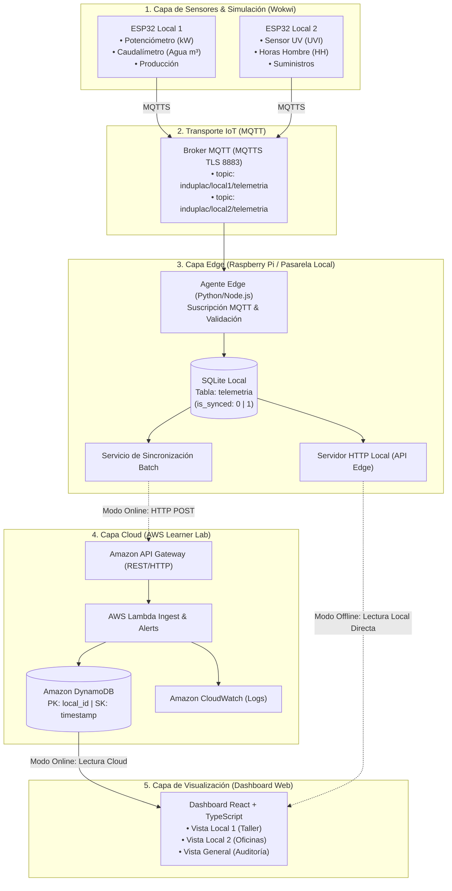
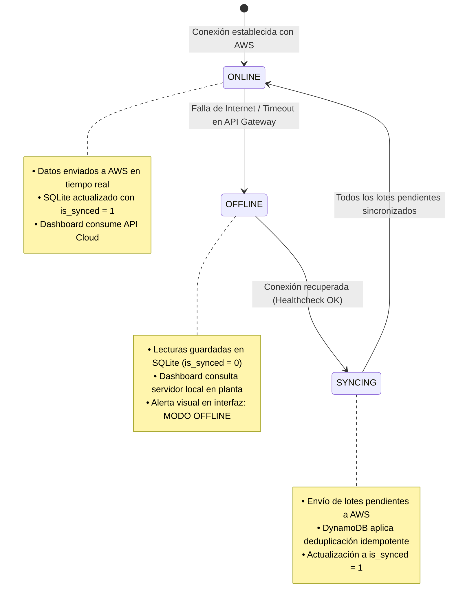

# 🏗️ Arquitectura Híbrida y Modelo de Integración — Induplac IoT

## 1. Propósito y Enfoque

La plataforma **Induplac IoT** está diseñada bajo un paradigma **híbrido (Edge + Cloud)** que garantiza continuidad operacional ininterrumpida ante caídas del suministro de Internet o contingencias en la nube, replicando el estándar de resiliencia desarrollado en *Project You Shall Not Pass*.

El sistema desacopla la captura y almacenamiento en planta de la consolidación analítica en la nube, permitiendo que la toma de decisiones locales continúe operando en todo momento.

---

## 2. Diagrama de Arquitectura Global



---

## 3. Detalle de Capas Técnicas

### 3.1. Capa 1: Captura y Microcontroladores (Wokwi / ESP32)
- **Entorno de Simulación:** Wokwi con emulación del microcontrolador ESP32-WROOM-32.
- **Conectividad:** Pila de red Wi-Fi virtual (`Wokwi-GUEST`) con soporte DHCP y DNS.
- **Comportamiento:** Cada 5 segundos realiza lectura analógica/digital, construye un payload JSON y lo publica hacia el broker MQTT.

### 3.2. Capa 2: Broker MQTT
- **Protocolo:** MQTT 3.1.1 / 5.0 sobre TLS (puerto 8883).
- **Segmentación por Tópicos:**
  - `induplac/local1/telemetria`
  - `induplac/local2/telemetria`
  - `induplac/alertas`

### 3.3. Capa 3: Pasarela Edge y Base de Datos Local (SQLite)
La pasarela local (Raspberry Pi o máquina anfitriona) actúa como buffer de continuidad.
Esquema de la tabla local en SQLite:

```sql
CREATE TABLE IF NOT EXISTS telemetria_local (
    record_id TEXT PRIMARY KEY,       -- UUIDv4 generado en Edge
    device_id TEXT NOT NULL,          -- Identificador de microcontrolador
    local_id TEXT NOT NULL,           -- local-1 | local-2
    timestamp INTEGER NOT NULL,       -- Unix timestamp en segundos UTC
    potencia_kw REAL NOT NULL,        -- Consumo eléctrico instantáneo
    agua_m3 REAL NOT NULL,            -- Consumo acumulado de agua
    indice_uv REAL NOT NULL,          -- Radiación UV
    unidades_prod INTEGER NOT NULL,   -- Unidades fabricadas
    hh_activas INTEGER NOT NULL,      -- Horas hombre activas
    is_synced INTEGER DEFAULT 0,      -- 0: Pendiente de sync | 1: Sincronizado en AWS
    created_at DATETIME DEFAULT CURRENT_TIMESTAMP
);

CREATE INDEX IF NOT EXISTS idx_sync ON telemetria_local(is_synced);
```

### 3.4. Capa 4: Nube AWS y Persistencia Políglota (NoSQL + SQL Relacional)

La nube implementa un modelo de **persistencia políglota**, utilizando el motor óptimo según la naturaleza de los datos:

1. **Amazon DynamoDB (NoSQL — Series Temporales y Telemetría Cruda):**
   - **Propósito:** Ingesta de alta frecuencia proveniente de los sensores ESP32 (cada 5 s).
   - **Tabla `Induplac_Telemetria`:**
     - **Partition Key (PK):** `local_id` (String)
     - **Sort Key (SK):** `timestamp` (Number)
   - Facturación bajo demanda (*Pay-per-request*), alta velocidad de escritura y costo mínimo.

2. **Amazon RDS PostgreSQL (SQL Relacional — Gestión, RBAC y Analítica):**
   - **Propósito:** Almacenar entidades que requieren integridad referencial, transacciones y consultas analíticas agregadas (comparaciones de períodos históricos).
   - **Despliegue:** Instancia `db.t3.micro` o `db.t4g.micro` en subred privada de la VPC, sin IP pública y accesible únicamente desde el Security Group de Lambda (`SG-Lambda` en puerto 5432).

#### Esquema Relacional en PostgreSQL (DDL)

```sql
-- Catálogo de Locales
CREATE TABLE locales (
    local_id VARCHAR(50) PRIMARY KEY,
    nombre VARCHAR(100) NOT NULL,
    descripcion TEXT,
    activo BOOLEAN DEFAULT TRUE,
    created_at TIMESTAMP WITH TIME ZONE DEFAULT CURRENT_TIMESTAMP
);

-- Catálogo de Dispositivos (ESP32)
CREATE TABLE dispositivos (
    device_id VARCHAR(50) PRIMARY KEY,
    local_id VARCHAR(50) REFERENCES locales(local_id),
    tipo_sensor VARCHAR(50) NOT NULL,
    ip_asignada INET,
    activo BOOLEAN DEFAULT TRUE,
    ultima_conexion TIMESTAMP WITH TIME ZONE
);

-- Umbrales de Alerta Configurables
CREATE TABLE umbrales_alerta (
    umbral_id SERIAL PRIMARY KEY,
    local_id VARCHAR(50) REFERENCES locales(local_id),
    variable VARCHAR(30) NOT NULL,       -- potencia_kw, agua_m3, indice_uv
    valor_advertencia NUMERIC(8, 2),     -- Nivel Amarillo
    valor_critico NUMERIC(8, 2),         -- Nivel Rojo
    updated_at TIMESTAMP WITH TIME ZONE DEFAULT CURRENT_TIMESTAMP
);

-- Roles y Control de Acceso (RBAC)
CREATE TABLE roles (
    rol_id VARCHAR(30) PRIMARY KEY,      -- operario, mantenimiento, administrador
    descripcion TEXT NOT NULL
);

CREATE TABLE usuarios (
    usuario_id UUID PRIMARY KEY DEFAULT gen_random_uuid(),
    email VARCHAR(150) UNIQUE NOT NULL,
    nombre_completo VARCHAR(150) NOT NULL,
    rol_id VARCHAR(30) REFERENCES roles(rol_id),
    activo BOOLEAN DEFAULT TRUE,
    created_at TIMESTAMP WITH TIME ZONE DEFAULT CURRENT_TIMESTAMP
);

-- Históricos Agregados para Comparaciones (Día vs Día anterior, Semana vs Semana anterior)
CREATE TABLE metricas_agregadas_diarias (
    id SERIAL PRIMARY KEY,
    local_id VARCHAR(50) REFERENCES locales(local_id),
    fecha DATE NOT NULL,
    energia_total_kwh NUMERIC(10, 2) NOT NULL,
    agua_total_m3 NUMERIC(10, 2) NOT NULL,
    produccion_total INT NOT NULL,
    uv_promedio NUMERIC(4, 2) NOT NULL,
    hh_totales INT NOT NULL,
    UNIQUE(local_id, fecha)
);
```

### 3.5. Capa 5: Infraestructura de Red y Túneles VPN Site-to-Site

Para una protección integral de la red de planta y la nube:
- **Redes en Planta:** Segmentadas mediante VLANs dedicadas (`192.168.10.0/24` para Local 1 y `192.168.20.0/24` para Local 2) con regla de firewall de salida exclusiva (*Zero Inbound Ports*).
- **VPN Site-to-Site (IPsec IKEv2 / AES-256):** Comunicación cifrada permanente entre el Customer Gateway de cada local y el Virtual Private Gateway (VGW) de la VPC en AWS.
- **Topología VPC:** Subredes públicas y privadas, enrutamiento seguro y Security Groups por referencia.

> 📖 Consulta los diagramas de topología y direccionamiento detallados en [**`infrastructure/README.md`**](../infrastructure/README.md).

---

## 4. Máquina de Estados Operacionales



---

## 5. Algoritmo de Sincronización e Idempotencia

Para asegurar que ningún dato se duplique ni se pierda durante transiciones de red:

```text
1. Healthcheck cada 10 segundos: ping a https://aws-api/health
2. SI healthcheck == OK:
      3. Consultar SQLite: SELECT * FROM telemetria_local WHERE is_synced = 0 LIMIT 50;
      4. SI hay registros pendientes:
            5. Enviar payload batch a AWS API Gateway.
            6. SI AWS responde HTTP 200/201:
                  7. UPDATE telemetria_local SET is_synced = 1 WHERE record_id IN (...);
            8. SINO:
                  9. Reintentar con retroceso exponencial (Exponential Backoff).
3. SINO:
      Permanece en modo OFFLINE reteniendo datos en SQLite.
```
