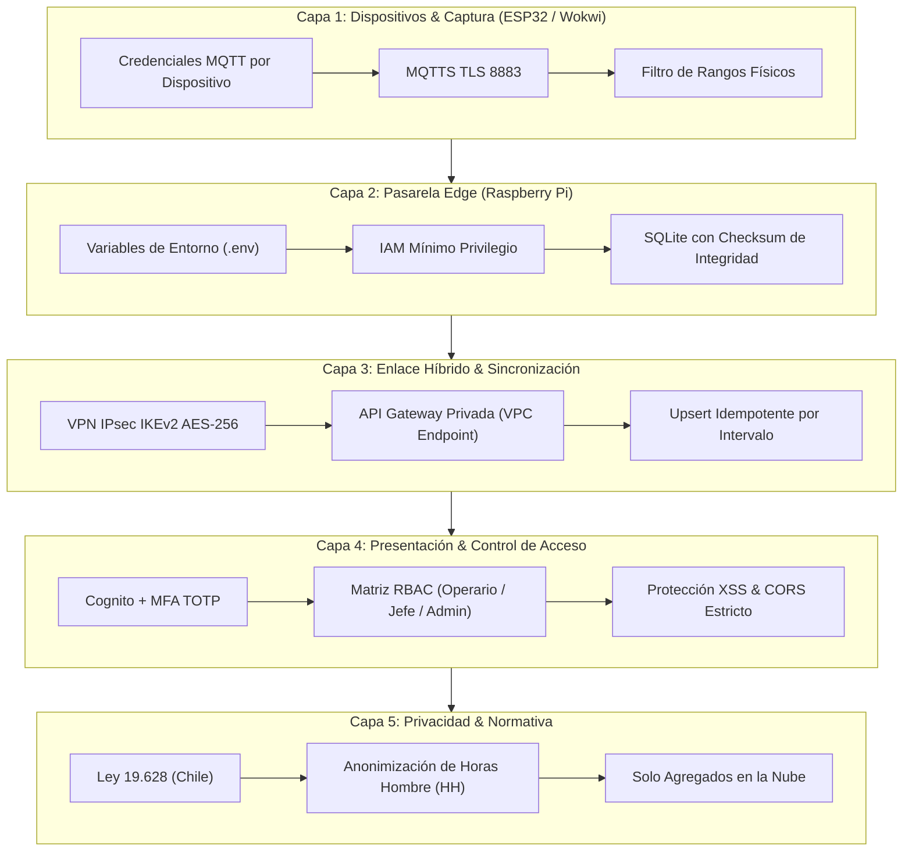

# 🔐 Estrategia de Ciberseguridad y Defensa en Profundidad — Induplac IoT

> Actualizado 2026-10-08: idempotencia por intervalo, VPN IPsec real con API Gateway privada y autenticación con MFA para roles con permisos de escritura.

## 1. Propósito y Alcance

La plataforma **Induplac IoT** procesa telemetría de consumo energético (kW), recursos hídricos (m³), radiación UV y métricas de producción y personal de dos locales operativos.

Dado que el sistema opera bajo una **arquitectura híbrida (Edge + Cloud)**, la superficie de ataque abarca desde la captura en microcontroladores (ESP32) y la red de planta (MQTT), hasta la pasarela local (Raspberry Pi / SQLite), el túnel VPN y la nube (AWS).

Este documento especifica el modelo de amenazas, las medidas técnicas y el marco de privacidad aplicado conforme a la normativa vigente en Chile.

---

## 2. Modelo de Amenazas (Matriz STRIDE aplicada a IoT)

| Categoría STRIDE | Amenaza en el contexto Induplac | Impacto | Mitigación Implementada |
| :--- | :--- | :--- | :--- |
| **Spoofing (Suplantación)** | Dispositivo no autorizado se conecta al broker simulando ser el ESP32 del Local 1. Usuario que se hace pasar por administrador. | Inyección de datos falsos; cambios de configuración no autorizados. | Credenciales MQTT únicas por dispositivo, conexiones anónimas denegadas. **MFA TOTP** obligatorio para roles con permisos de escritura. |
| **Tampering (Manipulación)** | Alteración de datos en SQLite durante un corte de Internet. | Pérdida de integridad del histórico. | Hash SHA-256 por lote y validación de rangos físicos antes de agregar y sincronizar. |
| **Repudiation (Repudio)** | Un usuario reconoce una alarma o cambia un umbral sin dejar registro. | Falta de trazabilidad. | Auditoría con marca temporal UTC e identificador de usuario en toda acción de escritura, incluidas las hechas offline en el Edge. |
| **Information Disclosure (Fuga)** | Interceptación de telemetría o credenciales en la red local o hacia AWS. | Exposición de patrones de producción o credenciales. | MQTTS (TLS 8883) en planta; **VPN IPsec** + HTTPS/TLS hacia una **API Gateway privada**; a la nube solo suben agregados; cero secretos en código (`.env`). |
| **Denial of Service** | Saturación del broker o del Edge con mensajes. | Dashboard sin datos, retardo de alarmas. | Rate limiting en el broker y descarte de payloads > 2 KB. |
| **Elevation of Privilege** | Un operario modifica umbrales o accede a la vista de otra sede. | Decisiones erróneas o fuga entre sedes. | RBAC con tokens JWT firmados por Cognito; escritura solo para grupos con MFA. |

---

## 3. Las 5 Capas de Defensa en Profundidad



---

### Capa 1: Seguridad en Microcontroladores y Protocolo MQTT
1. **Aislamiento de Tópicos MQTT:**
   - `induplac/local1/telemetria`
   - `induplac/local2/telemetria`
   - El broker deniega la publicación cruzada entre locales.
2. **Validación de Rangos Físicos:**
   - Potencia eléctrica: $0.0 \le kW \le 250.0$
   - Flujo de agua: $0.0 \le m^3/h \le 50.0$
   - Radiación UV: $0 \le UVI \le 15$
   - Una lectura fuera de rango se registra como anomalía de sensor y no entra al cálculo de intervalos.

---

### Capa 2: Seguridad en el Gateway Edge (Raspberry Pi & SQLite)
1. **Gestión de Secretos (Zero Hardcoding):** variables sensibles en `.env` ignorado por Git:
   ```bash
   MQTT_BROKER_HOST=broker.induplac.local
   MQTT_USER=gateway_edge_local
   MQTT_PASSWORD=****************
   AWS_API_URL=https://<api-id>-<vpce-id>.execute-api.us-east-1.amazonaws.com/prod
   AWS_ACCESS_KEY_ID=****************
   AWS_SECRET_ACCESS_KEY=****************
   IPSEC_PSK=****************
   ```
2. **Mínimo Privilegio (IAM):** el Edge solo puede invocar `POST /intervalos`, `POST /alertas`, `GET /umbrales` y `GET /health`. Sin permisos sobre DynamoDB, Lambda, RDS ni facturación.
3. **Hardening:** SSH solo con llaves Ed25519, sin login de root por contraseña; `ufw` permite solo 443 desde la VLAN de operarios y 8883 desde la VLAN IoT.

---

### Capa 3: Sincronización Segura e Idempotencia
1. **Transporte:** el Edge llega a AWS por el **túnel VPN IPsec** y consume una **API Gateway privada** cuya *resource policy* solo acepta tráfico del VPC Endpoint `execute-api`. La ingesta no existe en Internet público.
2. **Idempotencia por llave natural:**
   - Intervalo: `local_id + inicio_intervalo`.
   - Alerta: `local_id + variable + inicio_intervalo`.
   ```json
   {
     "local_id": 1,
     "inicio_intervalo": 1759874400,
     "energia_kw_prom": 42.7,
     "agua_m3": 0.81,
     "uv_max": 5.4
   }
   ```
   Si un lote se reenvía por inestabilidad de red, AWS hace *upsert* sobre la misma llave: los consumos no se cuentan dos veces y una alerta generada offline por el Edge no se duplica con la que detecta Lambda.

---

### Capa 4: Control de Acceso Basado en Roles (RBAC) con MFA

| Operación / Vista | Operario | Jefe de Mantenimiento/Operaciones | Administrador |
| :--- | :---: | :---: | :---: |
| **Ver dashboard de su propio local** | ✅ | ✅ | ✅ |
| **Ver dashboard de otro local / consolidado** | ❌ | ✅ | ✅ |
| **Reconocer / silenciar alertas** | ❌ | ✅ | ✅ |
| **Modificar umbrales de alerta** | ❌ | ❌ | ✅ |
| **Administrar usuarios y configuración** | ❌ | ❌ | ✅ |
| **Activar panel de simulación de fallas (demo)** | ❌ | ❌ | ✅ |
| **MFA obligatorio** | No | **Sí** | **Sí** |

- **Autenticación:** Amazon Cognito User Pool. **MFA TOTP** (compatible con Microsoft Authenticator) obligatorio para los grupos `jefe_mantenimiento_operaciones` y `administrador`. El Operario, de solo lectura, entra sin MFA.
- **Tokens:** JWT de 1 hora con refresco automático; el grupo del usuario viaja en el token y la API lo valida en cada solicitud.
- **Sin internet (propuesta a validar con el equipo):**
  - El Edge ofrece un **login local** con usuarios y roles replicados desde RDS para ver el dashboard de planta.
  - Un Jefe puede **reconocer alertas** offline; la acción queda auditada y se sincroniza después.
  - **Modificar umbrales, usuarios o configuración requiere conexión y MFA de Cognito**, para evitar conflictos con RDS y no guardar secretos MFA en el Edge.

---

### Capa 5: Privacidad y Normativa de Datos (Chile — Ley 19.628)

1. **Anonimización de Horas Hombre (HH):** sin identidades, RUT, tiempos por persona ni geolocalización de trabajadores; solo contadores agregados por turno.
2. **Solo agregados en la nube:** a AWS suben intervalos de 15 min, nunca la lectura cruda ni datos que identifiquen a la organización real o a personas.
3. **Datos de usuarios del sistema:** Cognito y RDS guardan solo lo necesario para autenticar y autorizar (correo corporativo, rol, configuración MFA).

---

## 4. Procedimiento de Verificación y Auditoría

1. **Inyección de rango inválido:** se inyectan $9999\text{ kW}$ desde el simulador. El Edge registra el rechazo y el valor no entra a los intervalos ni a AWS.
2. **Resistencia a replay:** se reenvía un lote ya sincronizado. AWS confirma sin duplicar consumos ni alertas.
3. **Violación de rol:** con sesión de Operario, el dashboard bloquea la vista consolidada y la configuración de umbrales.
4. **MFA:** un Administrador sin código TOTP válido no puede iniciar sesión ni cambiar umbrales.
5. **Alerta offline:** con la red cortada se inyecta UV ≥ 8; la alerta aparece en planta y, al reconectar, aparece una sola vez en la vista de gerencia.
