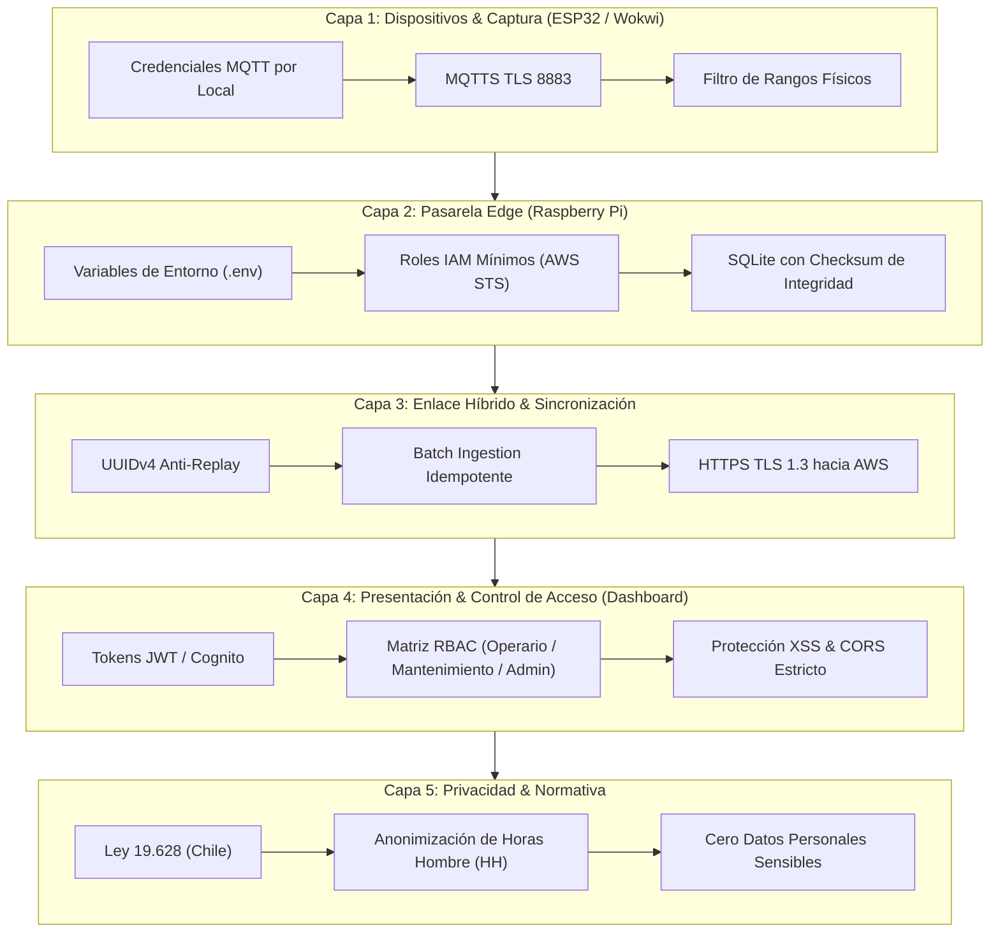

# 🔐 Estrategia de Ciberseguridad y Defensa en Profundidad — Induplac IoT

## 1. Propósito y Alcance

La plataforma **Induplac IoT** procesa telemetría crítica de consumo energético (kW), recursos hídricos (m³), índices de radiación UV y métricas de producción y personal de dos locales operativos.

Dado que el sistema opera bajo una **arquitectura híbrida (Edge + Cloud)**, la superficie de ataque abarca desde la captura física/simulada en microcontroladores (ESP32) y la red de planta (MQTT), hasta el almacenamiento en pasarelas locales (Raspberry Pi / SQLite) y la nube centralizada (AWS).

Este documento especifica el modelo de amenazas, las medidas técnicas implementadas y el marco de gobernanza y privacidad aplicado conforme a la normativa vigente en Chile.

---

## 2. Modelo de Amenazas (Matriz STRIDE aplicada a IoT)

Se evaluaron los vectores de riesgo específicos sobre cada frontera de confianza del sistema:

| Categoría STRIDE | Amenaza en el contexto Induplac | Impacto | Mitigación Implementada |
| :--- | :--- | :--- | :--- |
| **Spoofing (Suplantación)** | Dispositivo no autorizado conectándose al broker MQTT simulando ser el ESP32 del Local 1. | Inyección de datos falsos, alteración de métricas de producción. | Autenticación individual por cliente MQTT (usuario/contraseña únicos por dispositivo). Conexiones anónimas denegadas. |
| **Tampering (Manipulación)** | Alteración de mediciones almacenadas en la base SQLite local durante un corte de Internet. | Pérdida de integridad de auditoría histórica. | Generación de hash SHA-256 por lote y validación de rangos físicos lógicos antes de la sincronización. |
| **Repudiation (Repudio)** | Un operario desactiva o reconoce una alarma crítica sin dejar registro de autoría. | Falta de trazabilidad en incidentes operacionales. | Registro de auditoría con marca temporal UTC e identificador de usuario en toda acción administrativa. |
| **Information Disclosure (Fuga de Información)** | Interceptación de paquetes de telemetría o credenciales en la red local o en tránsito hacia AWS. | Exposición de patrones de producción industrial o credenciales cloud. | MQTTS sobre TLS 8883 en red local y HTTPS / TLS 1.3 hacia endpoints de API Gateway. Cero secretos en código (`.env`). |
| **Denial of Service (Denegación de Servicio)** | Saturación del broker MQTT o del Gateway Edge mediante flooding de mensajes. | Dashboard sin datos en tiempo real, retardo de alarmas. | Rate limiting en el broker MQTT y descarte de payloads que excedan el tamaño máximo permitido (máx. 2 KB). |
| **Elevation of Privilege (Elevación de Privilegios)** | Un usuario de planta modifica umbrales de alerta o accede al dashboard consolidado de gerencia. | Decisiones operativas erróneas o fuga de datos entre sedes. | Control de acceso basado en roles (RBAC) gestionado por tokens JWT firmados con roles estrictos. |

---

## 3. Las 5 Capas de Defensa en Profundidad



---

### Capa 1: Seguridad en Microcontroladores y Protocolo MQTT
1. **Aislamiento de Tópicos MQTT:**
   - Cada dispositivo publica únicamente en su tópico correspondiente:
     - `induplac/local1/telemetria`
     - `induplac/local2/telemetria`
   - El broker deniega permisos de publicación cruzada entre locales.
2. **Validación de Rangos Físicos (Sanitización en Ingesta):**
   - El microcontrolador y el Gateway descartan de inmediato mediciones que desafíen los límites de la física industrial:
     - Potencia eléctrica: $0.0 \le kW \le 250.0$
     - Flujo de agua: $0.0 \le m^3/h \le 50.0$
     - Radiación UV: $0 \le UVI \le 15$
   - Si una lectura cae fuera de rango, se clasifica como anomalía de sensor y se registra una alarma técnica sin propagar el valor erróneo a la base histórica.

---

### Capa 2: Seguridad en el Gateway Edge (Raspberry Pi & SQLite)
1. **Gestión de Secretos (Zero Hardcoding):**
   - El código fuente no contiene URLs privadas, tokens ni contraseñas.
   - Las variables sensibles residen en archivos `.env` ignorados por Git mediante `.gitignore`:
     ```bash
     MQTT_BROKER_HOST=broker.induplac.local
     MQTT_USER=gateway_edge_local
     MQTT_PASSWORD=****************
     AWS_API_GATEWAY_URL=https://xxxxxxxxxx.execute-api.us-east-1.amazonaws.com/prod
     AWS_ACCESS_KEY_ID=****************
     AWS_SECRET_ACCESS_KEY=****************
     ```
2. **Principio de Mínimo Privilegio (IAM):**
   - Las credenciales asignadas al Edge en AWS corresponden a un usuario o rol IAM exclusivo para ingesta:
     - Acción permitida: `execute-api:Invoke` sobre la ruta `POST /telemetria`.
     - Acciones denegadas: Creación, lectura, eliminación o modificación de tablas en DynamoDB, funciones Lambda o servicios de facturación.
3. **Hardening del Sistema Operativo Edge:**
   - Deshabilitación de acceso SSH mediante contraseña de root (únicamente llaves SSH Ed25519).
   - Bloqueo de puertos no requeridos mediante firewall local (`ufw`).

---

### Capa 3: Sincronización Segura y Protección Anti-Replay
1. **Idempotencia mediante UUIDv4:**
   - Cada medición generada en el Edge incorpora un identificador globalmente único:
     ```json
     {
       "record_id": "7b8e1f20-94f7-4c8d-bf34-a1b023de89fa",
       "device_id": "esp32-local-01",
       "timestamp": 1727736000,
       "is_synced": 0
     }
     ```
   - Al restablecerse la conectividad a Internet, la Lambda de AWS utiliza `record_id` como clave única. Si una solicitud batch se reenvía por inestabilidad de red, DynamoDB realiza un `putItem` idempotente o descarta el duplicado, asegurando que las métricas de consumo no se contabilicen dos veces.

---

### Capa 4: Control de Acceso Basado en Roles (RBAC en Dashboard)

El acceso a las interfaces web se segmenta de acuerdo con la responsabilidad operacional:

| Operación / Vista | Operario de Planta | Jefe de Mantenimiento | Administrador / Gerencia |
| :--- | :---: | :---: | :---: |
| **Ver Dashboard de su propio Local** | ✅ Permitido | ✅ Permitido | ✅ Permitido |
| **Ver Dashboard de otro Local** | ❌ Denegado | ✅ Permitido | ✅ Permitido |
| **Ver Dashboard Consolidado (Auditoría General)** | ❌ Denegado | ✅ Permitido | ✅ Permitido |
| **Reconocer / Silenciar Alertas Activas** | ❌ Denegado | ✅ Permitido | ✅ Permitido |
| **Modificar Umbrales Críticos de Consumo** | ❌ Denegado | ❌ Denegado | ✅ Permitido |
| **Activar Panel de Simulación de Fallas (Demo)** | ❌ Denegado | ❌ Denegado | ✅ Permitido |

- **Autenticación:** Mediante JSON Web Tokens (JWT) con tiempo de expiración corto (1 hora) y refresco automático.

---

### Capa 5: Privacidad y Normativa de Datos (Chile — Ley 19.628)

En cumplimiento con la legislación chilena sobre protección de la vida privada y datos personales (Ley 19.628):

1. **Anonimización Estricta de Horas Hombre (HH):**
   - El sistema no monitorea identidades individuales, números de RUT, tiempos por persona ni geolocalización de trabajadores.
   - La métrica de Horas Hombre representa únicamente un contador consolidado de horas sin incidentes operacionales por turno y cantidad agregada de personal activo en faena.
2. **Propiedad Industrial:**
   - La totalidad de los datos analíticos generados corresponden a métricas de consumo de suministros y eficiencia de maquinaria, sin invadir la privacidad individual de los colaboradores.

---

## 4. Procedimiento de Verificación y Auditoría

Para verificar la efectividad de las medidas de seguridad durante la presentación del prototipo:

1. **Prueba de Inyección de Rango Inválido:**
   - Se inyecta intencionalmente un valor de $9999\text{ kW}$ desde el simulador. El Edge Gateway debe registrar un log de rechazo y no propagar el valor a SQLite ni a AWS.
2. **Prueba de Resistencia a Replay Attack:**
   - Se reenvía manualmente un lote de telemetría previamente sincronizado. AWS debe confirmar la recepción sin duplicar el acumulado de energía o agua en DynamoDB.
3. **Prueba de Violación de Rol en Dashboard:**
   - Con sesión de `Operario`, el Dashboard debe ocultar y bloquear cualquier intento de acceso al panel consolidado o al panel de configuración de umbrales.
