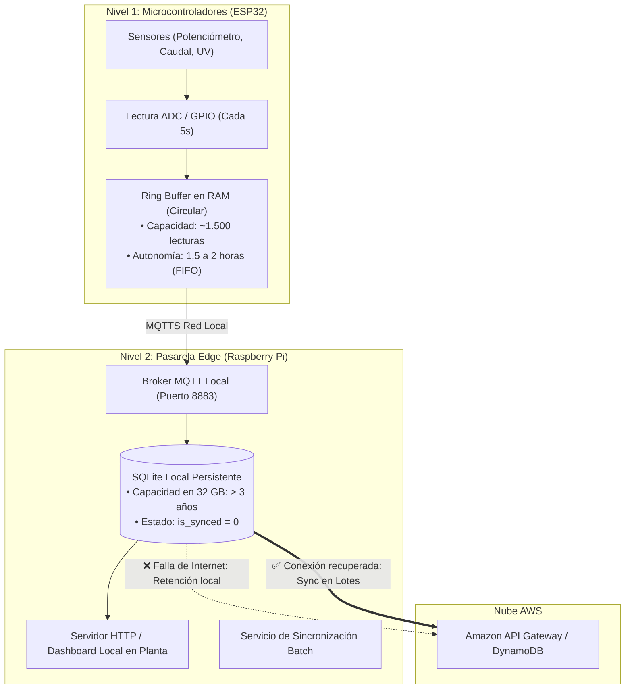

# 📴 Especificación del Modo Offline, Resiliencia y Retención de Datos — Induplac IoT

## 1. Justificación del Modelo Híbrido (Edge + Cloud)

En instalaciones industriales como **Induplac**, depender exclusivamente de una arquitectura 100% Cloud introduce un riesgo crítico: la pérdida de conectividad a Internet (por cortes de fibra óptica, fallas de ISP o problemas de red externa) dejaría a la planta **a ciegas**, interrumpiendo el monitoreo de seguridad operacional y generando vacíos irreversibles en la trazabilidad de consumo eléctrico y agua.

La arquitectura de **Induplac IoT** adopta un modelo híbrido basado en dos premisas:

1. **Autonomía Operacional Local (Supervivencia en Planta):**
   - El personal en faena debe visualizar variables críticas y alarmas (como picos de potencia eléctrica o radiación UV excesiva) en tiempo real con **latencia menor a 5 ms**, exista o no exista enlace con AWS.
2. **Consolidación y Auditoría Centralizada (Cloud):**
   - La nube de AWS consolida la visión gerencial de ambos locales, gestiona el control de acceso unificado (RBAC) y genera análisis comparativos históricos (semanales, mensuales y anuales).

> **Principio de Diseño:**  
> *La nube proporciona escala y analítica global; el Edge garantiza la continuidad operativa y la resiliencia local inmediata.*

---

## 2. Arquitectura de Almacenamiento en Dos Niveles (Two-Tier Buffering)

Ante una contingencia de conectividad, el almacenamiento se organiza en dos capas diferenciadas según la capacidad de hardware:



---

## 3. Capacidad de Retención y Límites de Hardware

### 3.1. Nivel 1: Microcontrolador ESP32
* **Hardware:** Microcontrolador ESP32 con 520 KB de SRAM interna y 4 MB de memoria Flash.
* **Mecanismo:** **Ring Buffer (Buffer circular en memoria RAM)**.
  - Almacena hasta **1.500 mediciones**.
  - A una tasa de 1 muestra cada 5 segundos, otorga **hasta 2 horas de autonomía** en caso de que la Raspberry Pi esté apagada, en mantenimiento o reiniciándose.
  - Al llenarse, aplica política **FIFO** (descarta el dato más antiguo para preservar la telemetría más reciente).

### 3.2. Nivel 2: Pasarela Edge (Raspberry Pi con SQLite)
* **Hardware:** Raspberry Pi 4 con almacenamiento en tarjeta MicroSD / disco SSD de **32 GB o 64 GB**.
* **Base de Datos:** SQLite local en modo WAL (*Write-Ahead Logging*) para soportar lecturas y escrituras simultáneas de alto rendimiento.

---

## 4. Cálculo Matemático de Almacenamiento y Autonomía

Para determinar cuánto tiempo exacto puede operar la plataforma sin conexión a Internet antes de agotar su capacidad:

| Parámetro | Valor Técnico |
| :--- | :--- |
| **Frecuencia de muestreo por local** | 1 lectura cada 5 segundos |
| **Muestras por minuto (1 local)** | $60 / 5 = 12\text{ lecturas/min}$ |
| **Muestras por hora (1 local)** | $12 \times 60 = 720\text{ lecturas/hora}$ |
| **Muestras por hora (2 locales combinados)** | $720 \times 2 = 1.440\text{ lecturas/hora}$ |
| **Muestras diarias totales (Ambos locales)** | $1.440 \times 24 = \mathbf{34.560\text{ registros/día}}$ |
| **Tamaño promedio por registro en SQLite** | $\approx 150 \text{ a } 200 \text{ bytes}$ (incluyendo índices y UUID) |
| **Consumo de disco diario** | $34.560 \times 200\text{ bytes} \approx \mathbf{6,91\text{ MB / día}}$ |
| **Consumo de disco semanal (7 días)** | $\approx \mathbf{48,4\text{ MB / semana}}$ |
| **Consumo de disco mensual (30 días)** | $\approx \mathbf{207,3\text{ MB / mes}}$ |
| **Consumo de disco anual (365 días)** | $\approx \mathbf{2,52\text{ GB / año}}$ |

### Conclusión de Capacidad:
En una tarjeta MicroSD estándar de **32 GB**, reservando 10 GB para el sistema operativo Linux y logs del sistema, quedan aproximadamente **22 GB libres exclusivamente para telemetría**.

$$\text{Autonomía Offline} = \frac{22.000\text{ MB}}{6,91\text{ MB/día}} \approx \mathbf{3.183\text{ días}}\;(\mathbf{> 8,7\text{ años de operación ininterrumpida sin Internet}})$$

> [!IMPORTANT]
> El sistema posee capacidad matemática para soportar cortes de conectividad de semanas o meses enteros sin pérdida de información.

---

## 5. Ciclo de Vida y Política de Purga de Datos (Data Lifecycle)

Para evitar la fragmentación del archivo SQLite y mantener tiempos de consulta óptimos en la pasarela local:

1. **Registros No Sincronizados (`is_synced = 0`):**
   - **Retención indefinida.** Ningún registro es eliminado mientras no exista confirmación HTTP 200/201 emitida por la API de AWS.
2. **Registros Sincronizados (`is_synced = 1`):**
   - **Retención local de 30 días:** Se conservan en el Edge para permitir al Dashboard en planta graficar comparativas recientes de forma instantánea sin requerir consultas salientes a Internet.
3. **Mantenimiento y Purga Automática (Cron Job Semanal):**
   - Se ejecuta una rutina programada los domingos a las 02:00 AM para depurar registros sincronizados con más de 30 días de antigüedad y compactar el archivo de base de datos:

```sql
-- Purga de datos sincronizados antiguos
DELETE FROM telemetria_local 
WHERE is_synced = 1 
  AND timestamp < strftime('%s', 'now', '-30 days');

-- Recuperación de espacio en disco
VACUUM;
```

---

## 6. Procedimiento de Transición de Estados

### 6.1. Detección de Falla (Online ➔ Offline)
1. El demonio de sincronización del Edge emite un *healthcheck* cada 10 segundos hacia `https://api.induplac.aws/health`.
2. Si se registran **3 fallas consecutivas** o un *timeout* superior a 3.000 ms:
   - El sistema conmuta su bandera interna a `STATE_OFFLINE`.
   - Se mantiene la ingesta de MQTT directamente hacia SQLite con `is_synced = 0`.
   - El Dashboard en planta detecta el estado y conmuta automáticamente su *endpoint* hacia la IP local de la Raspberry Pi (`http://192.168.10.10:8000/api/telemetria`), alertando al operario:
     ```text
     🔴 MODO OFFLINE — Operando sobre Gateway local (Sin conexión con AWS)
     ```

### 6.2. Recuperación y Sincronización (Offline ➔ Syncing ➔ Online)
1. Al restablecerse el enlace, el *healthcheck* responde exitosamente (HTTP 200).
2. El sistema pasa a `STATE_SYNCING`.
3. El servicio de sincronización recupera bloques de **50 registros** (`LIMIT 50`) ordenados cronológicamente (`ORDER BY timestamp ASC`).
4. Se envían en un payload *batch* hacia AWS API Gateway.
5. AWS persiste en DynamoDB de forma **idempotente** (utilizando el `record_id` UUIDv4 como clave para ignorar posibles duplicados).
6. Tras recibir confirmación exitosa de AWS, el Edge ejecuta:
   ```sql
   UPDATE telemetria_local 
   SET is_synced = 1 
   WHERE record_id IN ('uuid-1', 'uuid-2', ...);
   ```
7. Al no restar registros pendientes con `is_synced = 0`, el sistema vuelve a `STATE_ONLINE`.
