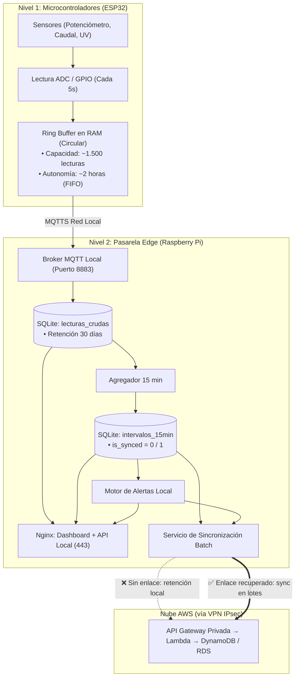

# 📴 Especificación del Modo Offline, Resiliencia y Retención de Datos — Induplac IoT

> Actualizado 2026-10-08: agregación de 15 min en el Edge, alertas locales y dashboard de planta servido desde el Edge (ADR-05, ADR-06, ADR-07).

## 1. Justificación del Modelo Híbrido (Edge + Cloud)

En instalaciones industriales como **Induplac**, depender exclusivamente de una arquitectura 100% Cloud introduce un riesgo crítico: la pérdida de conectividad a Internet (cortes de fibra, fallas del ISP o caída del túnel VPN) dejaría a la planta **a ciegas**, interrumpiendo el monitoreo de seguridad operacional y generando vacíos en la trazabilidad de consumo.

La arquitectura de **Induplac IoT** adopta un modelo híbrido basado en dos premisas:

1. **Autonomía Operacional Local (Supervivencia en Planta):**
   - El personal en faena ve las variables críticas y **recibe las alertas** en tiempo real exista o no enlace con AWS. **Sin internet, el dashboard de planta funciona exactamente igual que con internet**; solo cambia el indicador de enlace.
2. **Consolidación y Auditoría Centralizada (Cloud):**
   - AWS consolida la visión gerencial de ambos locales, gestiona usuarios y roles (RBAC + MFA) y genera análisis comparativos históricos.

> **Principio de Diseño:**  
> *El Edge filtra, guarda, agrega y alerta; AWS consolida, compara y decide.*

---

## 2. Arquitectura de Almacenamiento en Dos Niveles (Two-Tier Buffering)



---

## 3. Capacidad de Retención y Límites de Hardware

### 3.1. Nivel 1: Microcontrolador ESP32
* **Hardware:** ESP32 con 520 KB de SRAM interna y 4 MB de Flash.
* **Mecanismo:** **Ring Buffer en RAM** de hasta **1.500 mediciones** (≈ 2 horas a 1 muestra cada 5 s) para cubrir reinicios o mantención de la Raspberry Pi. Al llenarse aplica **FIFO**.
* **Hora:** el ESP32 sincroniza su reloj por **NTP** al arrancar para que las lecturas del buffer lleguen con marca de tiempo válida.

### 3.2. Nivel 2: Pasarela Edge (Raspberry Pi con SQLite)
* **Hardware:** Raspberry Pi 4 con MicroSD / SSD de **32 GB o 64 GB**.
* **Base de datos:** SQLite en modo WAL con tres tablas principales:

| Tabla | Contenido | ¿Sube a AWS? |
| :--- | :--- | :---: |
| `lecturas_crudas` | Cada lectura validada (cada 5 s) | No |
| `intervalos_15min` | Promedios / máximos / acumulados por local cada 15 min, con `is_synced` | Sí |
| `alertas_local` | Alertas generadas por el Edge, con `is_synced` | Sí |

---

## 4. Cálculo de Almacenamiento y Autonomía

**Supuesto explícito:** cada local publica **un mensaje JSON con todas sus variables** cada 5 segundos.

### 4.1. Lecturas crudas (solo locales)
| Parámetro | Valor |
| :--- | :--- |
| Lecturas por día (2 locales) | $2 \times 17.280 = \mathbf{34.560}$ |
| Tamaño por registro | $\approx 200\text{ bytes}$ (incluye índices) |
| Consumo diario | $\approx \mathbf{6,9\text{ MB/día}}$ |
| Retención | 30 días → $\approx \mathbf{210\text{ MB}}$ ocupados de forma constante |

### 4.2. Intervalos de 15 minutos (los que se sincronizan)
| Parámetro | Valor |
| :--- | :--- |
| Intervalos por día (2 locales) | $2 \times 96 = \mathbf{192}$ |
| Tamaño por registro | $\approx 300\text{ bytes}$ |
| Consumo diario | $\approx \mathbf{58\text{ KB/día}}$ |
| Consumo anual | $\approx \mathbf{21\text{ MB/año}}$ |

### Conclusión de Capacidad
En una MicroSD de **32 GB**, reservando 10 GB para el sistema operativo y logs, quedan ≈ **22 GB** para datos. El crudo ocupa un tamaño fijo (~210 MB) y **un año completo sin internet acumula solo ~21 MB de intervalos pendientes**.

> [!IMPORTANT]
> **El almacenamiento deja de ser una restricción para el modo offline:** el Edge puede operar meses o años sin conexión sin perder ningún intervalo ni alerta pendiente de sincronizar.

---

## 5. Ciclo de Vida y Política de Purga de Datos

1. **Intervalos y alertas no sincronizados (`is_synced = 0`):** **retención indefinida**. Nada se elimina sin confirmación HTTP 200/201 de AWS.
2. **Intervalos sincronizados (`is_synced = 1`):** se conservan **13 meses** en el Edge. Sirven para el dashboard de planta sin internet (comparaciones históricas) y como base de la regla de energía (mínimo 4 semanas).
3. **Lecturas crudas:** se conservan **30 días** (ya están resumidas en los intervalos).
4. **Purga automática (cron semanal, domingos 02:00):**

```sql
-- Crudo con más de 30 días
DELETE FROM lecturas_crudas
WHERE ts < strftime('%s', 'now', '-30 days');

-- Intervalos ya sincronizados con más de 13 meses
DELETE FROM intervalos_15min
WHERE is_synced = 1
  AND inicio_intervalo < strftime('%s', 'now', '-13 months');

VACUUM;
```

---

## 6. Procedimiento de Transición de Estados

```
ONLINE ──3 fallos──▶ OFFLINE ──healthcheck OK──▶ SINCRONIZANDO ──pendientes = 0──▶ ONLINE
```

### 6.1. Lo que NO cambia entre estados
- El ESP32 publica, el Edge valida y guarda, calcula intervalos cada 15 min y **evalúa alertas**.
- El dashboard de planta, servido por el Edge (`https://edge.induplac.local`), **sigue mostrando datos en tiempo real y alertas**. No conmuta de endpoint.

### 6.2. Detección de Falla (Online ➔ Offline)
1. El servicio de sincronización emite un *healthcheck* cada 10 s a `GET ${AWS_API_URL}/health` (API Gateway privada, por el túnel VPN).
2. Con **3 fallas consecutivas** o un *timeout* > 3.000 ms el Edge pasa a `STATE_OFFLINE`.
3. El dashboard de planta muestra el indicador:
   ```text
   🔴 OFFLINE — Sin enlace con AWS. Monitoreo y alertas locales activos.
   ```
4. El dashboard de gerencia (nube) muestra el local como **desconectado**, con su último dato y hora.

### 6.3. Recuperación y Sincronización (Offline ➔ Sincronizando ➔ Online)
1. El *healthcheck* responde HTTP 200 → `STATE_SYNCING`.
2. El Edge toma bloques de **50 intervalos** pendientes en orden cronológico:
   ```sql
   SELECT * FROM intervalos_15min
   WHERE is_synced = 0
   ORDER BY inicio_intervalo ASC
   LIMIT 50;
   ```
3. Envía el lote a `POST /intervalos`. Lambda hace *upsert* en DynamoDB con la llave `local_id + inicio_intervalo`, evalúa las reglas de alerta y registra en RDS.
4. Las alertas generadas offline se envían a `POST /alertas`. RDS hace *upsert* con la llave `local_id + variable + inicio_intervalo`, de modo que la misma alerta **no se duplica** aunque Lambda también la detecte.
5. Tras la confirmación de AWS:
   ```sql
   UPDATE intervalos_15min SET is_synced = 1
   WHERE local_id = ? AND inicio_intervalo IN (...);
   ```
6. En la misma sincronización el Edge descarga los **umbrales vigentes** desde RDS.
7. Sin pendientes → `STATE_ONLINE`.

### 6.4. Si lo que se cae es la Raspberry Pi
El ESP32 retiene hasta ~2 horas en su ring buffer y las reenvía al volver la Pi. Si el corte supera esa capacidad, se descartan las lecturas más antiguas (FIFO).
