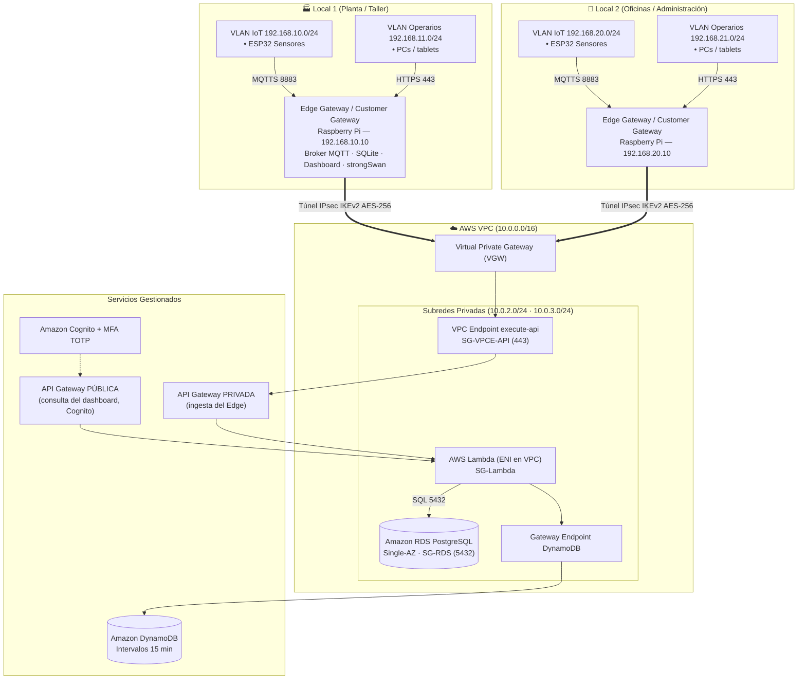
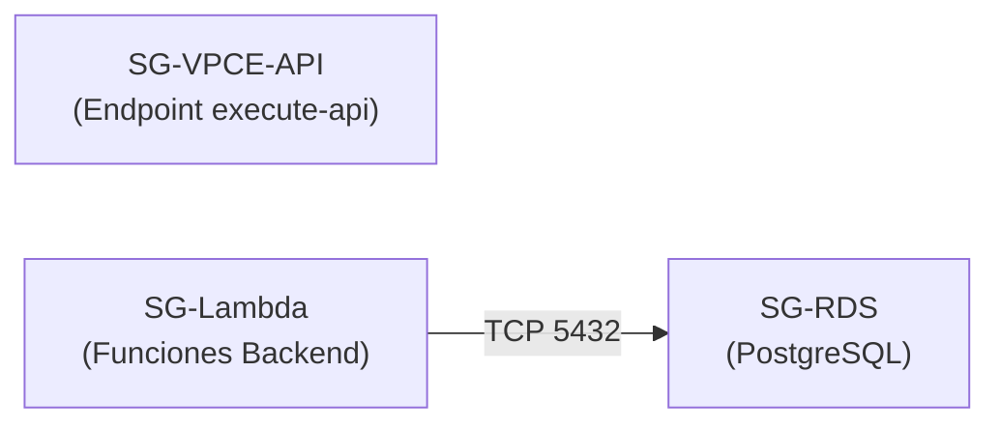

# 🌐 Infraestructura de Red y Conectividad Cloud — Induplac IoT

Este documento describe la topología de red del proyecto **Induplac IoT**: la segmentación en los locales físicos, la interconexión segura mediante **VPN Site-to-Site** y el diseño de la **VPC** en AWS.

> Actualizado 2026-10-08: VPN real con API Gateway privada para la ingesta, VLAN de operarios, sin NAT Gateway y RDS Single-AZ.

---

## 1. Topología General de Red



**Dos APIs con propósitos distintos:**
- **API privada (ingesta):** solo alcanzable desde la VPC a través del VPC Endpoint; el Edge llega por la VPN. Expone `POST /intervalos`, `POST /alertas`, `GET /umbrales`, `GET /health`.
- **API pública (consulta):** la usa el dashboard de gerencia desde Internet, protegida con un *authorizer* de Cognito (JWT). Solo lectura de indicadores e histórico y acciones de usuarios con MFA.

---

## 2. Segmentación en Locales Físicos (LAN & Edge)

| Parámetro | Local 1 (Planta / Taller) | Local 2 (Administración) |
| :--- | :--- | :--- |
| **VLAN IoT** | `192.168.10.0/24` | `192.168.20.0/24` |
| **Edge Gateway (Raspberry Pi)** | `192.168.10.10` | `192.168.20.10` |
| **DHCP sensores (ESP32)** | `192.168.10.100 - 192.168.10.200` | `192.168.20.100 - 192.168.20.200` |
| **VLAN Operarios** | `192.168.11.0/24` | `192.168.21.0/24` |
| **Aislamiento** | Los ESP32 solo hablan MQTTS con el Edge. Los operarios solo llegan al Edge por HTTPS. | Igual que Local 1. |
| **Firewall perimetral** | Solo salida (*Stateful Egress*); el túnel VPN se inicia desde la planta. **Cero puertos entrantes**. | Igual que Local 1. |

### 2.1. Acceso de Operarios al Dashboard Local (ejemplo Local 1)

```
ip access-list extended OPERARIOS_A_EDGE
 permit tcp 192.168.11.0 0.0.0.255 host 192.168.10.10 eq 443
 deny   ip  192.168.11.0 0.0.0.255 192.168.10.0 0.0.0.255
 permit ip  any any
!
interface Vlan11
 ip access-group OPERARIOS_A_EDGE in
```

- **DNS local:** `edge.induplac.local` → `192.168.10.10` (en el router o en la propia Pi).
- **Certificado:** emitido por una CA interna instalada en los equipos de planta (autofirmado para la demo). Let's Encrypt no sirve porque no renueva sin Internet.

---

## 3. Conexión VPN Site-to-Site (IPsec)

* **Componentes:**
  - **Customer Gateway (CGW):** strongSwan en el Edge Gateway de cada sede.
  - **Virtual Private Gateway (VGW):** asociado a la VPC.
* **Parámetros:**
  - **Protocolo:** IPsec con **IKEv2**.
  - **Cifrado:** AES-GCM-256 con HMAC-SHA-384.
  - **Redundancia:** 2 túneles por conexión.
  - **Rutas:** estáticas hacia `192.168.10.0/24` y `192.168.20.0/24` en la VPC; `10.0.0.0/16` por el túnel en el Edge.
* **Resolución de la API privada:** el Edge usa el nombre DNS específico del VPC Endpoint (`<api-id>-<vpce-id>.execute-api.us-east-1.amazonaws.com`), que resuelve a IPs privadas de la VPC y viaja por el túnel.
* **Ventaja:** la ingesta entra **directamente a la subred privada** sin endpoints públicos; cifrado en Capa 3 (IPsec) bajo Capa 7 (TLS).
* **Plan B:** si el Learner Lab no permite VGW/VPN, una instancia EC2 pequeña con strongSwan actúa como extremo del túnel dentro de la VPC.

---

## 4. Diseño de la VPC en AWS

| Recurso | Configuración | Propósito |
| :--- | :--- | :--- |
| **Bloque CIDR VPC** | `10.0.0.0/16` | Sin superposición con las sedes (`192.168.x.x`). |
| **Subred Privada 1** | `10.0.2.0/24` (us-east-1a) | Lambda (ENI), RDS, VPC Endpoint `execute-api`. |
| **Subred Privada 2** | `10.0.3.0/24` (us-east-1b) | Requerida por el Subnet Group de RDS. |
| **NAT Gateway** | **No se usa** | Lambda accede a DynamoDB por Gateway Endpoint gratuito. |
| **RDS** | `db.t3.micro` PostgreSQL **Single-AZ** | Ahorro de crédito; se apaga fuera de pruebas. |

---

## 5. Matriz de Security Groups (Seguridad por Referencia)



1. **`SG-VPCE-API`:** entrada TCP 443 solo desde `192.168.10.0/24` y `192.168.20.0/24` (sedes vía VPN).
2. **`SG-Lambda`:** sin entrada; salida TCP 5432 solo hacia `SG-RDS` y HTTPS hacia los endpoints de la VPC.
3. **`SG-RDS`:** entrada TCP 5432 solo desde `SG-Lambda`; sin IP pública (`PubliclyAccessible: false`).

---

## 6. Consideraciones de Costo para AWS Academy Learner Lab

> [!WARNING]
> **Servicios con costo por hora (valores aproximados, verificar precios vigentes en us-east-1):**
> - **Conexión VPN Site-to-Site:** ~USD 0,05/h por conexión → ~USD 36/mes por sede si queda encendida 24/7 (~USD 72/mes con 2 sedes).
> - **VPC Interface Endpoint (`execute-api`):** ~USD 0,01/h por AZ → ~USD 7/mes por AZ.
>
> Con USD 100 de crédito, **la VPN y el endpoint se crean para las sesiones de prueba y la demo y se eliminan al terminar** (idealmente con un script o plantilla para recrearlos en minutos). Para las pruebas diarias basta **una sola conexión VPN** (Local 1).

> [!TIP]
> **Servicios de costo mínimo:**
> - DynamoDB on-demand y Gateway Endpoint de DynamoDB: prácticamente USD 0.
> - Lambda y API Gateway: dentro de la capa gratuita para el volumen del proyecto.
> - RDS `db.t3.micro` Single-AZ: apagado cuando no se usa.
> - Sin NAT Gateway.

> [!NOTE]
> **Verificar en el Learner Lab** que se permita crear VPN Site-to-Site, VPC Interface Endpoints y Cognito con MFA antes de comprometer la demo a esos servicios.
