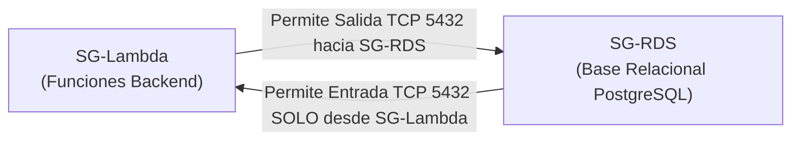

# 🌐 Infraestructura de Red y Conectividad Cloud — Induplac IoT

Este documento describe la topología de red completa del proyecto **Induplac IoT**, cubriendo la segmentación en los locales físicos, la interconexión segura mediante **VPN Site-to-Site** y el diseño de la **Virtual Private Cloud (VPC)** en AWS.

---

## 1. Topología General de Red

```mermaid
flowchart TD
    subgraph LOCAL1["🏭 Local 1 (Planta / Taller) — 192.168.10.0/24"]
        VLAN10["VLAN IoT (192.168.10.0/24)<br/>• ESP32 Sensores<br/>• Broker MQTT Local (8883)"]
        CGW1["Edge Gateway / Customer Gateway<br/>(Raspberry Pi — 192.168.10.10)"]
        VLAN10 --> CGW1
    end

    subgraph LOCAL2["🏢 Local 2 (Oficinas / Administración) — 192.168.20.0/24"]
        VLAN20["VLAN IoT (192.168.20.0/24)<br/>• ESP32 Sensores<br/>• Broker MQTT Local (8883)"]
        CGW2["Edge Gateway / Customer Gateway<br/>(Raspberry Pi — 192.168.20.10)"]
        VLAN20 --> CGW2
    end

    subgraph INTERNET["Internet / Red Pública"]
        IPSEC1["Túnel IPsec 1 & 2 (AES-256, IKEv2)"]
        IPSEC2["Túnel IPsec 1 & 2 (AES-256, IKEv2)"]
    end

    subgraph AWS_VPC["☁️ AWS VPC (10.0.0.0/16)"]
        VGW["Virtual Private Gateway (VGW)"]
        
        subgraph PUBLIC_SUBNET["Subred Pública (10.0.1.0/24)"]
            NAT["NAT Gateway"]
            IGW["Internet Gateway"]
        end

        subgraph PRIVATE_SUBNET["Subred Privada (10.0.2.0/24)"]
            Lambda["AWS Lambda (ENI en VPC)<br/>SG-Lambda"]
            RDS[("Amazon RDS PostgreSQL<br/>(Multi-AZ / Privada)<br/>SG-RDS (Puerto 5432)")]
            VPCE["VPC Endpoints (DynamoDB, Secrets Manager)"]
        end
    end

    subgraph CLOUD_SERVICES["Servicios Cloud Gestionados"]
        Dynamo[("Amazon DynamoDB<br/>(Telemetría Cruda NoSQL)")]
        APIGW["API Gateway (HTTPS Dashboard)"]
    end

    CGW1 -->|IPsec VPN| IPSEC1 --> VGW
    CGW2 -->|IPsec VPN| IPSEC2 --> VGW
    VGW --> PRIVATE_SUBNET

    NAT --> IGW
    Lambda -->|Conexión SQL (5432)| RDS
    Lambda -->|SDK AWS| VPCE --> Dynamo
    APIGW --> Lambda
```

---

## 2. Segmentación en Locales Físicos (LAN & Edge)

Para mitigar riesgos de movimiento lateral en caso de que un microcontrolador sea vulnerado:

| Parámetro | Local 1 (Planta / Taller) | Local 2 (Administración) |
| :--- | :--- | :--- |
| **Segmento de Red (VLAN IoT)** | `192.168.10.0/24` | `192.168.20.0/24` |
| **Gateway Edge (Raspberry Pi)** | `192.168.10.10` | `192.168.20.10` |
| **Rango DHCP Sensores (ESP32)** | `192.168.10.100 - 192.168.10.200` | `192.168.20.100 - 192.168.20.200` |
| **Aislamiento de Red** | VLAN aislada para dispositivos IoT sin acceso a equipos administrativos de oficina. | VLAN aislada sin visibilidad cruzada con equipos de contabilidad/ventas. |
| **Reglas de Firewall Perimetral** | **Solo tráfico de salida** (Stateful Egress). Cero puertos entrantes abiertos al exterior (*Zero Inbound Ports*). | **Solo tráfico de salida** (Stateful Egress). Cero puertos entrantes abiertos al exterior. |

---

## 3. Conexión VPN Site-to-Site (IPsec)

Para evitar exponer el tráfico de telemetría y sincronización en Internet público, se utiliza una **VPN Site-to-Site gestionada**:

* **Componentes:**
  - **Customer Gateway (CGW):** Configurado en el Edge Gateway de cada sede física (Raspberry Pi ejecutando strongSwan o router compatible con IPsec).
  - **Virtual Private Gateway (VGW):** Puerta de enlace VPN en la VPC de AWS.
* **Cifrado y Parámetros:**
  - **Protocolo:** IPsec con **IKEv2**.
  - **Cifrado:** AES-GCM-256 bits con HMAC-SHA-384.
  - **Redundancia:** 2 túneles activos/pasivos independientes por cada sede hacia AWS.
* **Ventaja Arquitectónica:**
  - El tráfico del Edge entra **directamente a la subred privada de la VPC**, sin pasar por endpoints públicos.
  - **Defensa en profundidad:** Se suma cifrado a nivel de red (Capa 3 OSI con IPsec) por debajo del cifrado de aplicación (Capa 7 con TLS/HTTPS).

---

## 4. Diseño de la VPC en AWS

| Recurso | Configuración | Propósito |
| :--- | :--- | :--- |
| **Bloque CIDR VPC** | `10.0.0.0/16` | Espacio privado no superpuesto con los locales (`192.168.x.x`). |
| **Subred Pública** | `10.0.1.0/24` (us-east-1a) | Aloja el NAT Gateway y el Internet Gateway para salida controlada. |
| **Subred Privada 1** | `10.0.2.0/24` (us-east-1a) | Aloja funciones Lambda (ENI) y base de datos primaria RDS. |
| **Subred Privada 2** | `10.0.3.0/24` (us-east-1b) | Requerida para el Subnet Group de RDS (alta disponibilidad Multi-AZ). |

---

## 5. Matriz de Security Groups (Seguridad por Referencia)

Se descarta el uso de reglas basadas en direcciones IP volátiles; en su lugar, se aplican **Security Groups referenciados por grupo**:



1. **`SG-Lambda` (Security Group para AWS Lambda):**
   - **Inbound:** Sin reglas de entrada (Lambda solo responde a eventos).
   - **Outbound:** Permitido tráfico TCP puerto 5432 con destino exclusivo a `SG-RDS`.
2. **`SG-RDS` (Security Group para RDS PostgreSQL):**
   - **Inbound:** Permitido tráfico TCP puerto 5432 exclusivamente con origen `SG-Lambda`.
   - **Outbound:** Sin salida a Internet; denegado por defecto.
   - **IP Pública:** Deshabilitada (`PubliclyAccessible: false`).

---

## 6. Consideraciones de Costo para AWS Academy Learner Lab

> [!TIP]
> **Optimización de Presupuesto en Learner Lab:**
> - El **NAT Gateway** tiene un costo por hora (~$0.045/hr) que puede mermar el saldo de $100.
> - **Alternativa económica:** Para la comunicación entre Lambda y DynamoDB/Secrets Manager dentro de la VPC, se utilizan **VPC Endpoints de tipo Gateway (gratuitos)** para DynamoDB (`com.amazonaws.us-east-1.dynamodb`).
> - Para la base relacional, se selecciona una instancia **`db.t3.micro` o `db.t4g.micro` en PostgreSQL Single-AZ**, apagándola cuando no esté en sesiones de prueba para maximizar la duración de los créditos.
